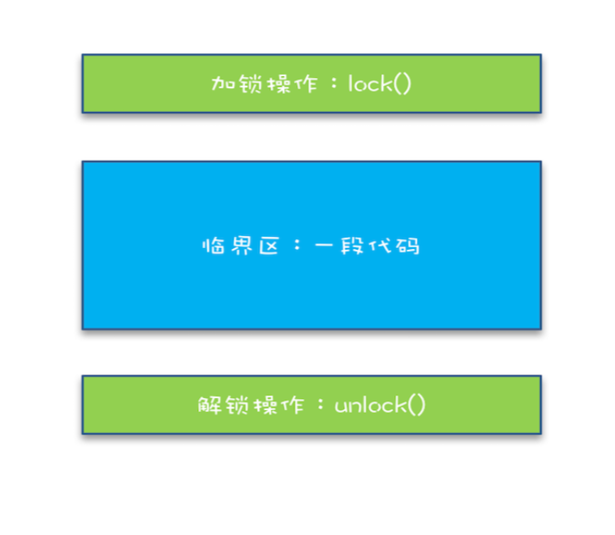
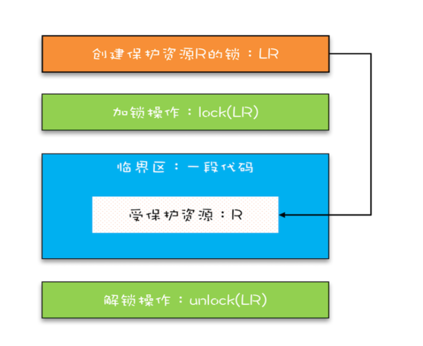
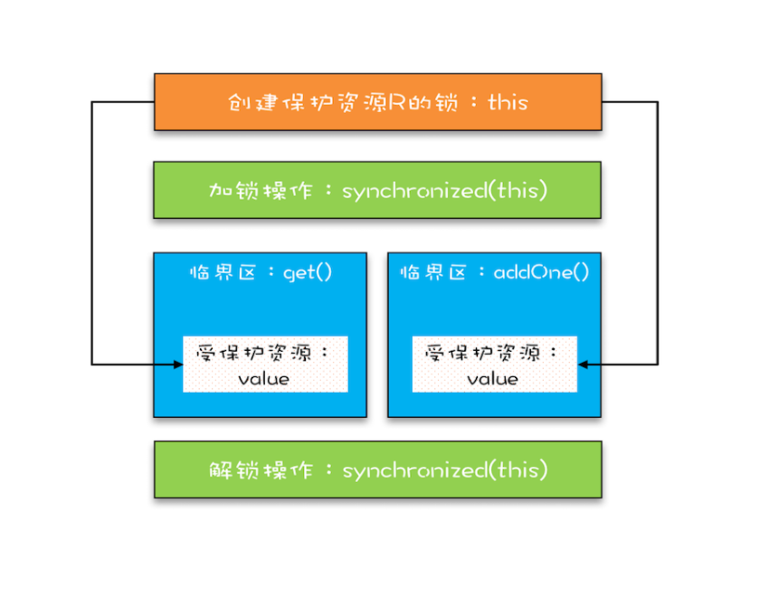
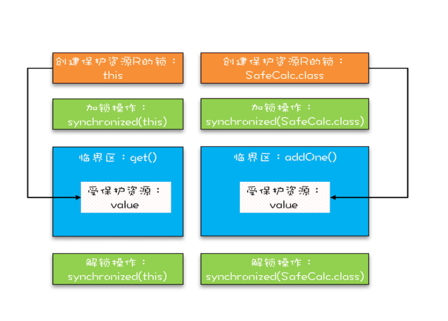

## 互斥锁：解决原子性问题
原子性问题的源头是**线程切换**

**互斥**：同一时刻只有一个线程执行

## 1. 锁模型
### 1.1 简易锁模型


我们把一段需要互斥执行的代码称为临界区。线程在进入临界区之前，首先尝试加锁 lock()，如果成功，则进入临界区，此时我们称这个线程持有锁;否则呢就等待，直到持 有锁的线程解锁;持有锁的线程执行完临界区的代码后，执行解锁 unlock()。

### 1.2 改进后的锁模型
锁和锁要保护的资源是有对应关系的，比如你用你家的锁保护你家的东西，我用我家的锁保护我家的东西。在并发编程世界里，锁和资源也应该有这个关
系，但这个关系在我们上面的模型中是没有体现的，所以我们需要完善一下我们的模型。



首先，我们要把临界区要保护的资源标注出来，如图中临界区里增加了一个元素:受保护 的资源 R;其次，我们要保护资源 R 就得为它创建一把锁 LR;最后，针对这把锁 LR，我 们还需在进出临界区时添上加锁操作和解锁操作。另外，在锁 LR 和受保护资源之间，我 特地用一条线做了关联，这个关联关系非常重要。很多并发 Bug 的出现都是因为把它忽略 了，然后就出现了类似锁自家门来保护他家资产的事情，这样的 Bug 非常不好诊断，因为 潜意识里我们认为已经正确加锁了。

## 2. synchronized
锁是一种通用的技术方案，Java 语言提供的 synchronized 关键字，就是锁的一种实现。 synchronized 关键字可以用来修饰方法，也可以用来修饰代码块，它的使用示例基本上都 是下面这个样子:
```
class X {
  // 1.修饰非静态方法
  synchronized void foo() {
  // 临界区
  }
  // 2.修饰静态方法
  synchronized static void bar() {
  // 临界区
  }
  // 3.修饰代码块
  Object obj = new Object();
  void baz() {
    synchronized(obj) {
    // 临界区
    }
  }
}
```
Java 编译器会在 synchronized 修饰的方法或代码块前后自动加上加锁 lock() 和解锁 unlock()。

上面的代码我 们看到只有修饰代码块的时候，锁定了一个 obj 对象，那修饰方法的时候锁定的是什么 呢?这个也是 Java 的一条隐式规则:
- 当修饰静态方法的时候，锁定的是当前类的 Class 对象，在上面的例子中就 是 Class X;
- 当修饰非静态方法的时候，锁定的是当前实例对象 this。

### 2.1 synchronized 解决 count+=1问题

```
class SafeCalc {
  long value = 0L;
  long get(){
    return value;
  }

  synchronized void addOne(){
    vallue += 1;
  }
}

```
我们先来看看 addOne() 方法，首先可以肯定，被 synchronized 修饰后，无论是单核 CPU 还是多核 CPU，只有一个线程能够执行 addOne() 方法，所以一定能保证原子操 作，那是否有可见性问题呢?

**管程中锁的规则**:对一个锁的解锁 Happens-Before 于后续对这个锁的加锁。

管程，就是我们这里的 synchronized(至于为什么叫管程，我们后面介绍)，我们知道 synchronized 修饰的临界区是互斥的，也就是说同一时刻只有一个线程执行临界区的代码;而所谓“对一个锁解锁 Happens-Before 后续对这个锁的加锁”，指的是前一个线程 的解锁操作对后一个线程的加锁操作可见，综合 Happens-Before 的传递性原则，我们就 能得出前一个线程在临界区修改的共享变量(该操作在解锁之前)，对后续进入临界区 (该操作在加锁之后)的线程是可见的。

按照这个规则，如果多个线程同时执行 addOne() 方法，可见性是可以保证的，也就说如 果有 1000 个线程执行 addOne() 方法，最终结果一定是 value 的值增加了 1000。

管程中锁的规则，是只保证后续对这个锁的 加锁的可见性，而 get() 方法并没有加锁操作，所以可见性没法保证。那如何解决呢?很 简单，就是 get() 方法也 synchronized 一下，完整的代码如下所示。

value 的值对 get() 方法可见性是没有保证的。管程中锁的规则，是只保证后续对这个锁的 加锁的可见性，而 get() 方法并没有加锁操作，所以可见性没法保证。那如何解决呢?很 简单，就是 get() 方法也 synchronized 一下，完整的代码如下所示。

```
class SafeCalc {
  long value = 0L;
  synchronized long get() {
    return value;
  }
  synchroniz ed void addOne{
    value += 1；
  }
}

```
get() 方法和 addOne() 方法都需要访问 value 这个受保护的资源，这个资源用 this 这把锁来保护。线程要进入临 界区 get() 和 addOne()，必须先获得 this 这把锁，这样 get() 和 addOne() 也是互斥的。



这个模型更像现实世界里面球赛门票的管理，一个座位只允许一个人使用，这个座位就 是“受保护资源”，球场的入口就是 Java 类里的方法，而门票就是用来保护资源 的“锁”，Java 里的检票工作是由 synchronized 解决的。

## 3. 锁和受保护资源的关系
**受保护资源和锁之间的关联关系是 N:1 的关系。**

```
class SafeCalc{
  static long value = 0L;
  synchronized long get(){
    return value;
  }

  synchronized static void addOne(){
    value += 1;
  }
}
```

改动后的代码是用两个锁保护一个资源。这个受保护的资源就 是静态变量 value，两个锁分别是 this 和 SafeCalc.class。我们可以用下面这幅图来形象 描述这个关系。由于临界区 get() 和 addOne() 是用两个锁保护的，因此这两个临界区没 有互斥关系，临界区 addOne() 对 value 的修改对临界区 get() 也没有可见性保证，这就**导致并发**问题了。



## 4. 总结
下面的代码用 synchronized 修饰代码块来尝试解决并发问题，你觉得这个使用方式正确 吗?有哪些问题呢?能解决可见性和原子性问题吗?
```
class SafeCalc {
  long value = 0L;
  long get() {
    synchronized (new Object()){
      return value;
    }
  }

  void addOne(){
    synchronized (new Object()){
      value += 1;
    }
  }
}
```
加锁本质就是在锁对象的对象头中写入当前线程id，但是new object每次在内存中都是新对象，所以加锁无效。
