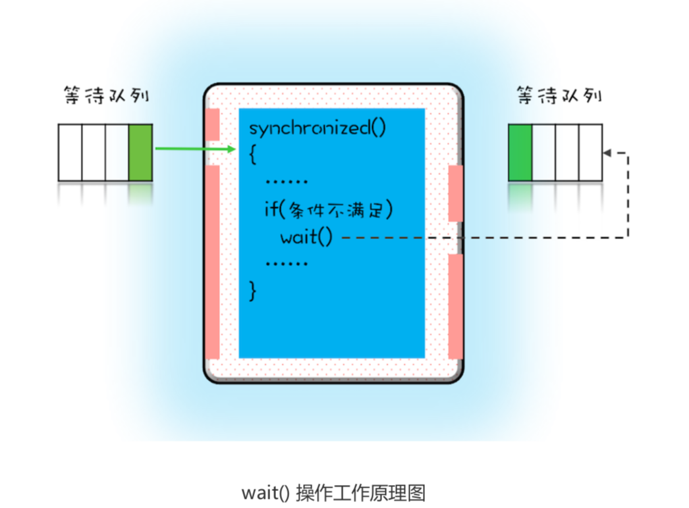
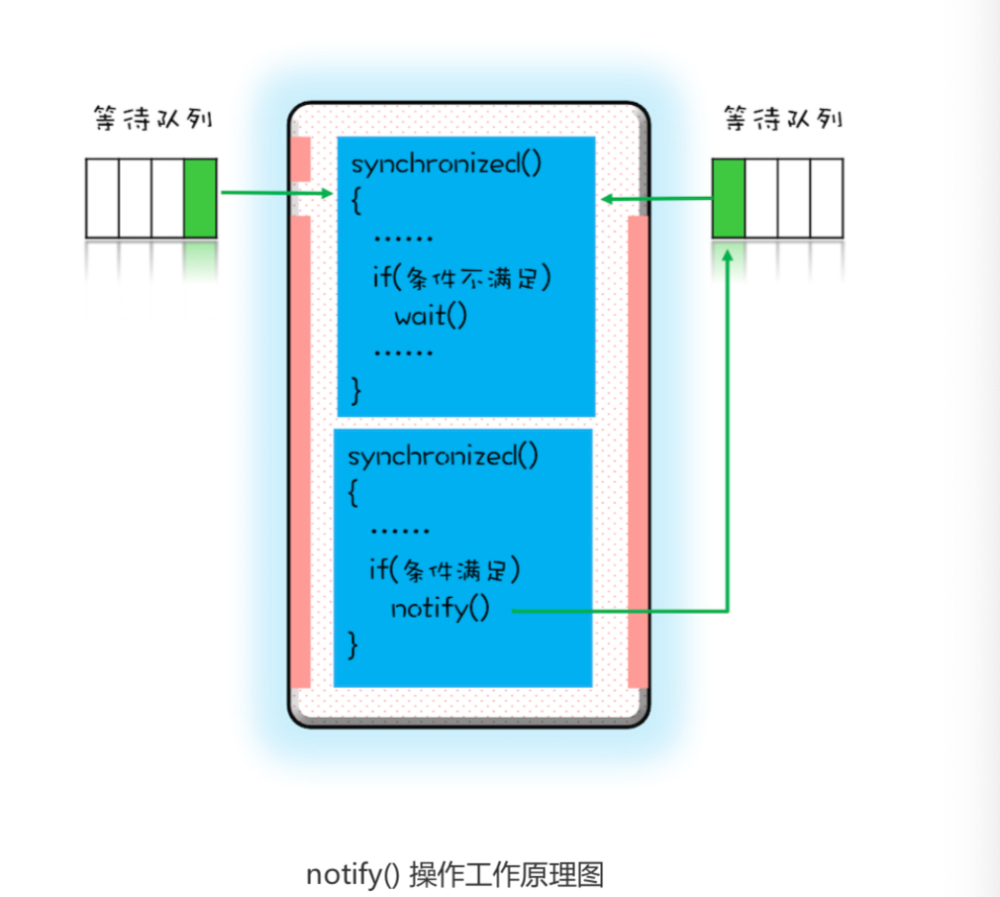

# 用“等待-通知”机制优化循环等待

## 1. 问题
由上一篇文章你应该已经知道，在破坏占用且等待条件的时候，如果转出账本和转入账本不满足 同时在文件架上这个条件，就用死循环的方式来循环等待，核心代码如下:

```
// 一次性申请转出账户和转入账户，直到成功
while(!actr.apply(this, target)) ;
```
如果 apply() 操作耗时非常短，而且并发冲突量也不大时，这个方案还挺不错的，因为这种场景下，循环上几次或者几十次就能一次性获取转出账户和转入账户了。但是如果 apply() 操作耗时长，或者并发冲突量大的时候，循环等待这种方案就不适用了，因为在这种场景下，可能要循环上万次才能获取到锁太消耗 CPU了。

其实在这种场景下，最好的方案应该是:如果线程要求的条件(转出账本和转入账本同在文件架 上)不满足，则线程阻塞自己，进入**等待**状态;当线程要求的条件(转出账本和转入账本同在文 件架上)满足后，
**通知**等待的线程重新执行。其中，使用线程阻塞的方式就能避免循环等待消耗 CPU 的问题。

**一个完整的等待 - 通知机制:线程首先获取互斥锁，当线程要求的条件不满足时，释放互斥锁，进入等待状态;当要求的条件满足时，通知等待的线程，重新获取互斥锁。**

## 2. 用 synchronized 实现等待 - 通知机制
在 Java 语言里，等待 - 通知机制可以有多种实现方式，比如 Java 语言内置的 synchronized 配 合 wait()、notify()、notifyAll() 这三个方法就能轻松实现。

在下面这个图里，左边有一个等待队 列，同一时刻，只允许一个线程进入 synchronized 保护的临界区(这个临界区可以看作大夫的 诊室)，当有一个线程进入临界区后，其他线程就只能进入图中左边的等待队列里等待(相当于 患者分诊等待)。**这个等待队列和互斥锁是一对一的关系，每个互斥锁都有自己独立的等待队列。**



在并发程序中，当一个线程进入临界区后，由于某些条件不满足，需要进入等待状态，Java 对象的 wait() 方法就能够满足这种需求。如上图所示，当调用 wait() 方法后，当前线程就会被阻塞， 并且进入到右边的等待队列中，**这个等待队列也是互斥锁的等待队列**。 线程在进入等待队列的同时，**会释放持有的互斥锁**，线程释放锁后，其他线程就有机会获得锁，并进入临界区了。

当条件满足时调用 notify()， 会通知等待队列(互斥锁的等待队列)中的线程，告诉它条件曾经满足过。


为什么说是曾经满足过呢?因为**notify() 只能保证在通知时间点，条件是满足的**。而被通知线程的**执行时间点和通知的时间点基本上不会重合**，所以当线程执行的时候，很可能条件已经不满足了(保不齐有其他线程插队)。这一点你需要格外注意。

wait()、notify()、notifyAll() 都是在 synchronized{}内部被调用的。如果在 synchronized{}外部调用，或者锁定的 this，而用 target.wait() 调用的话，JVM 会抛出一个运行时异常:
```
java.lang.IllegalMonitorStateException。
```

## 3. 一个更好地资源分配器
等待 - 通知机制的基本原理搞清楚后，我们就来看看它如何解决一次性申请转出账户和转入账户 的问题吧。在这个等待 - 通知机制中，我们需要考虑以下四个要素。
1. 互斥锁:上一篇文章我们提到 Allocator 需要是单例的，所以我们可以用 this 作为互斥锁。
2. 线程要求的条件:转出账户和转入账户都没有被分配过。
3. 何时等待:线程要求的条件不满足就等待。
4. 何时通知:当有线程释放账户时就通知。

当 wait() 返回时，有可能条件 已经发生变化了，曾经条件满足，但是现在已经不满足了，所以要重新检验条件是否满足。范 式，意味着是经典做法，所以没有特殊理由不要尝试换个写法。

```
class Allocator {
  private List<Object> als;

  // 一次性申请所有资源
  synchronized void apply(Object from, Object to){
    // 经典写法
    while(!als.contains(from) || !als.contains(to)){
      try{
        wait();
      }catch(Exception e){
      }
    }
    als.add(from);
    als.add(to);
  }

    // 归还资源
  synchronized void free(Object from, Object to){
    als.remove(from);
    als.remove(to);
    notifyAll();
    }
}

```

## 4. 尽量使用notifyAll()
notify() 是会随机地通知等待队列中的一个线程，而 notifyAll() 会通知等待队列中的 所有线程。

能够进入临界区。但那所谓的感觉往往都蕴藏着风险，实际上使用 notify() 也很有风险，它的风 险在于可能导致某些线程永远不会被通知到。

假设我们有资源 A、B、C、D，线程 1 申请到了 AB，线程 2 申请到了 CD，此时线程 3 申请 AB，会进入等待队列(AB 分配给线程 1，线程 3 要求的条件不满足)，线程 4 申请 CD 也会进 入等待队列。我们再假设之后线程 1 归还了资源 AB，如果使用 notify() 来通知等待队列中的线 程，有可能被通知的是线程 4，但线程 4 申请的是 CD，所以此时线程 4 还是会继续等待，而真 正该唤醒的线程 3 就再也没有机会被唤醒了。

所以除非经过深思熟虑，否则尽量使用 notifyAll()。

## 5. sleep && wait
wait() 方法和 sleep() 方法都能让当前线程挂起一段时间，那它们的区别是什么?

wait与sleep区别在于:
1. wait会释放所有锁而sleep不会释放锁资源.
2. wait只能在同步方法和同步块中使用，而sleep任何地方都可以.
3. wait无需捕捉异常，而sleep需要.
4. sleep是Thread的方法，而wait是Object类的方法;
5. sleep方法调用的时候必须指定时间

两者相同点:都会让渡CPU执行时间，等待再次调度!
