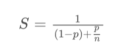

# 安全性、活跃性以及性能问题
并发编程中我们需要注意的问题有很多，主要有三个方面：
- 安全性问题
- 活跃性问题
- 性能问题

## 1. 安全性问题
线程安全，其实本质上就是正确性，而正确性的含义就是程序按照我们期望的执行。
并发 Bug 的三个主要源头:
- 原子性问题
- 可见性问题
- 有序性问题

那是不是所有的代码都需要认真分析一遍是否存在这三个问题呢?当然不是，其实只有一种情况 需要:**存在共享数据并且该数据会发生变化，通俗地讲就是有多个线程会同时读写同一数据。**

那 如果能够做到不共享数据或者数据状态不发生变化，不就能够保证线程的安全性了嘛。有不少技术方案都是基于这个理论的，例如线程`本地存储(Thread Local Storage，TLS)`、`不变模式`等等。

**数据竞争(Data Race)**：当多个线程同时访问同一数据，并且至少有一个线程会写这个数据的时候，如果我们不采取防护 措施，那么就会导致并发 Bug。当多个线程调用时候就会发生数据竞争，如下所 示。

```
public class Test {
  private long count = 0;
  void add10K(){
    int idx = 0;
    while(id++ < 10000){
      count += 1;
    }
  }
}
```
那是不是在访问数据的地方，我们加个锁保护一下就能解决所有的并发问题了呢?显然没有这么 简单。例如，对于上面示例，我们稍作修改，增加两个被 synchronized 修饰的 get() 和 set() 方 法， add10K() 方法里面通过 get() 和 set() 方法来访问 value 变量，修改后的代码如下所示。 对于修改后的代码，所有访问共享变量 value 的地方，我们都增加了互斥锁，此时是不存在数据 竞争的。但很显然修改后的 add10K() 方法并不是线程安全的。

```
public class Test {
  private long count = 0;

  synchronized long get(){
    return count;
  }

  synchronized void set(long v){
    count = v;
  }

  void add10K(){
    int idx = 0;
    while(id++ < 10000){
      set(get() + 1);
    }
  }
}
```
假设 count=0，当两个线程同时执行 get() 方法时，get() 方法会返回相同的值 0，两个线程执 行 get()+1 操作，结果都是 1，之后两个线程再将结果 1 写入了内存。你本来期望的是 2，而结 果却是 1。

这种问题，有个官方的称呼，叫**竞态条件(Race Condition)**。 所谓 **竞态条件，指的是程序的执 行结果依赖线程执行的顺序**。例如上面的例子，如果两个线程完全同时执行，那么结果是 1;如 果两个线程是前后执行，那么结果就是 2。在并发环境里，线程的执行顺序是不确定的，如果程 序存在竞态条件问题，那就意味着程序执行的结果是不确定的，而执行结果不确定这可是个大 Bug。

下面再结合一个例子来说明下**竞态条件**，就是前面文章中提到的转账操作。转账操作里面有个判 断条件——转出金额不能大于账户余额，但在并发环境里面，如果不加控制，当多个线程同时对 一个账号执行转出操作时，就有可能出现超额转出问题。假设账户 A 有余额 200，线程 1 和线 程 2 都要从账户 A 转出 150，在下面的代码里，有可能线程 1 和线程 2 同时执行到第 6 行，这 样线程 1 和线程 2 都会发现转出金额 150 小于账户余额 200，于是就会发生超额转出的情况。

```
if (状态变量 满足 执行条件){
  执行操作
}
```
当某个线程发现状态变量满足执行条件后，开始执行操作;可是就在这个线程执行操作的时候，其他线程同时修改了状态变量 导致状态变量不满足执行条件了 当然很多场景下 这个条件不是显式的，例如前面 addOne 的例子中，set(get()+1) 这个复合操作，其实就隐式依赖 get() 的 结果。

**解决方案**：互斥。互斥的方案有很多，PU 提供了相关的互斥指令，操作系统、编程语言 也会提供相关的 API。从逻辑上来看，我们可以统一归为:**锁。**

## 2. 活跃性问题
所谓活跃性问题，指的是某个操作无法执行下去。我们常见的“死锁”就是一种典型的活跃性问 题，当然
**除了死锁外，还有两种情况，分别是“活锁”和“饥饿”。**

#### 2.1 活锁
**活锁**：有时线程虽然没有发生阻塞，但仍然会存在执行不下去的情况。

但有时线程虽然没有发生阻塞，但仍然会存在执行不下去的情况，这就是所谓的“活锁”。可以 类比现实世界里的例子，路人甲从左手边出门，路人乙从右手边进门，两人为了不相撞，互相谦 让，路人甲让路走右手边，路人乙也让路走左手边，结果是两人又相撞了。这种情况，基本上谦 让几次就解决了，因为人会交流啊。可是如果这种情况发生在编程世界了，就有可能会一直没完 没了地“谦让”下去，成为没有发生阻塞但依然执行不下去的“活锁”。

解决“活锁”的方案很简单，谦让时，尝试等待一个随机的时间就可以了。例如上面的那个例子，路人甲走左手边发现前面有人，并不是立刻换到右手边，而是等待一个随机的时间后，再换 到右手边;同样，路人乙也不是立刻切换路线，也是等待一个随机的时间再切换。由于路人甲和 路人乙等待的时间是随机的，所以同时相撞后再次相撞的概率就很低了。“等待一个随机时 间”的方案虽然很简单，却非常有效，Raft 这样知名的分布式一致性算法中也用到了它。

#### 2.2 饥饿
**饥饿**：线程因无法访问所需资源而无法执行下去的情况。
“不患寡，而患不均”，如果线程优先级“不均”，在 CPU 繁忙的情况下，优先级低的线 程得到执行的机会很小，就可能发生线程“饥饿”;持有锁的线程，如果执行的时间过长，也可 能导致“饥饿”问题。

-  保证资源充足，
-  公平地分配资源: 公平锁，是一种先来后到的
方案，线程的等待是有顺序的，排在等待队列前面的线程会优先获得资源。
-  避免持有锁的线程长时间执行。

这三个方案中，方案一和方案三的适用场景比较有限，因为很多场景下，资源的稀缺性是没办法解决的，持有锁的线程执行的时间也很难缩短。倒是方案二的适用场景相对来说更多一些。

## 3. 性能问题
使用“锁”要非常小心，但是如果小心过度，也可能出“性能问题”。“锁”的过度使用可能导
致串行化的范围过大，这样就不能够发挥多线程的优势了，而我们之所以使用多线程搞并发程
序，为的就是提升性能。

所以我们要尽量减少串行，那串行对性能的影响是怎么样的呢?假设串行百分比是 5%，我们用 多核多线程相比单核单线程能提速多少呢?

有个阿姆达尔(Amdahl)定律，代表了处理器并行运算之后效率提升的能力，它正好可以解决 这个问题，具体公式如下:



公式里的 n 可以理解为 CPU 的核数，p 可以理解为并行百分比，那(1-p)就是串行百分比了， 也就是我们假设的 5%。我们再假设 CPU 的核数(也就是 n)无穷大，那加速比 S 的极限就是 20。也就是说，如果我们的串行率是 5%，那么我们无论采用什么技术，最高也就只能提高 20 倍的性能。

所以使用锁的时候一定要关注对性能的影响。 那怎么才能避免锁带来的性能问题呢?这个问题很 复杂，Java SDK 并发包里之所以有那么多东西，有很大一部分原因就是要提升在某个特定领域 的性能。

第一，既然使用锁会带来性能问题，那最好的方案自然就是使用无锁的算法和数据结构了。在这 方面有很多相关的技术，例如线程本地存储 (Thread Local Storage, TLS)、写入时复制 (Copy- on-write)、乐观锁等;Java 并发包里面的原子类也是一种无锁的数据结构;Disruptor 则是一 个无锁的内存队列，性能都非常好。

第二，减少锁持有的时间。互斥锁本质上是将并行的程序串行化，所以要增加并行度，一定要减 少持有锁的时间。这个方案具体的实现技术也有很多，例如使用细粒度的锁，一个典型的例子就 是 Java 并发包里的 ConcurrentHashMap，它使用了所谓分段锁的技术(这个技术后面我们会 详细介绍);还可以使用读写锁，也就是读是无锁的，只有写的时候才会互斥。

性能方面的度量指标有很多，我觉得有三个指标非常重要，就是:吞吐量、延迟和并发量。

1. 吞吐量:指的是单位时间内能处理的请求数量。吞吐量越高，说明性能越好。
2. 延迟:指的是从发出请求到收到响应的时间。延迟越小，说明性能越好。
3. 并发量:指的是能同时处理的请求数量，一般来说随着并发量的增加、延迟也会增加。所以延
迟这个指标，一般都会是基于并发量来说的。例如并发量是 1000 的时候，延迟是 50 毫秒。
