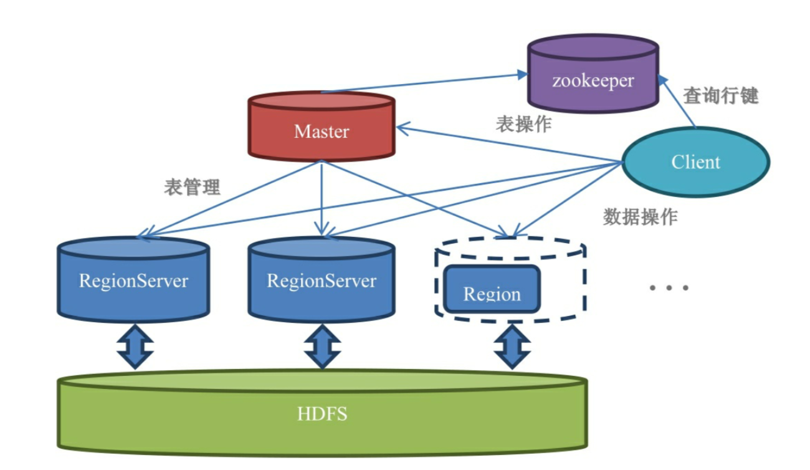
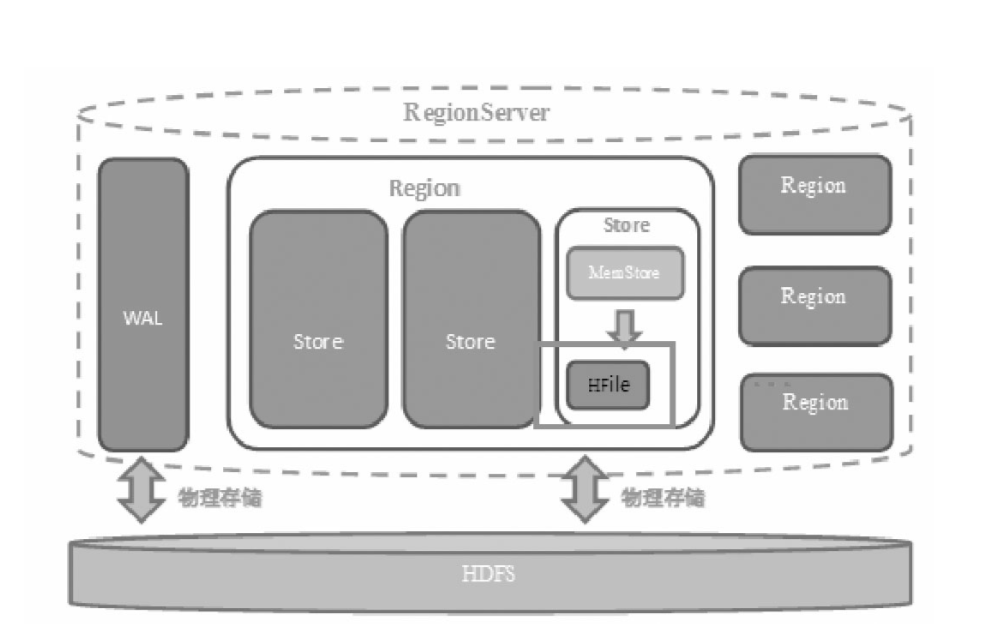
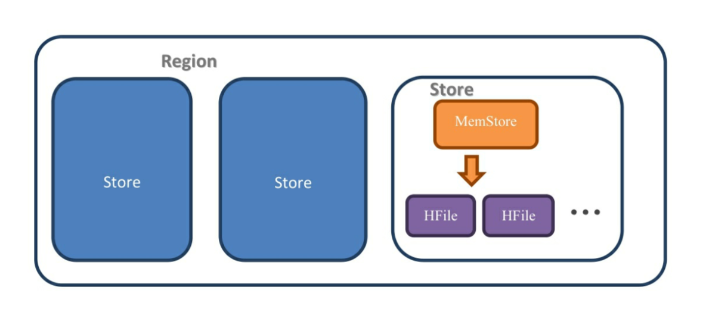
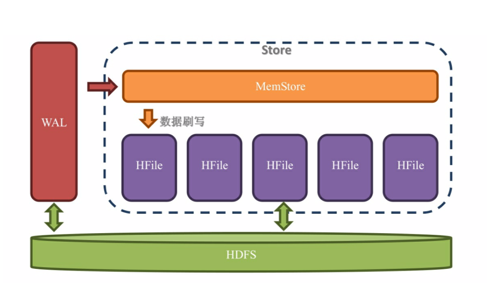

#
## 1.宏观架构


- **Master**:负责启动的时候分配Region到具体的RegionServer，执行各种管理操作，比如Region的分割和合并，创建表、修改列族配置。挂了之后业务系统也能运行。

- **RegionServer**:RegionServer上有一个或多个Region。我们读取的数据存储在Region。
- **Region**:表的一部分数据。HBase是一个会自动分片的数据库。一个Region就相当于关系型数据库中分区表中的一个分区。

- **HDFS**：HBase不与服务器硬盘直接交互，而是与HDFS交互，HDFS是真正承载数据的载体。

- **ZooKeeper**：ZK重要性超过Master，ZK关闭后不能读取数据，因为读取数据需要的元数据表hbase:meta位置存储在ZK上。

### 1.1 RegionServer架构


- **WAL**：Write-Ahead Log，预写日志，预先写入。当操作到达Region的时候，HBase先把操作写入到WAL里面。HBase会先把数据放到基于内存的Memstore里，等数据到达一定的数量时才刷写(flush)到最终存储的HFile内。在此过程中如果断电或者宕机，可以从WAL中恢复数据。
- **多个Region**：Region相当于一个数据分片。每一个Region都有其实rowkey和结束rowkey，代表了它所存储的row范围。

### 1.2 Region内部结构

  - **多个Store**：每一个Region内部都包含了多个Store实例。一个Store对应一个列族的数据，如果一个表有两个列族，那么在一个Region里面就有两个Store。Store内部有MemStore和HFile两个部分组成。

## 2. 预写日志WAL
  WAL设计用来解决宕机之后操作恢复问题。数据到达Region的时候先写入WAL，然后再被加载到MemStore。就算Region的机器宕掉，由于WAL的数据是存在HDFS上，所以数据不会丢失。

### 2.1 WAL关闭打开
WAL默认开启。关闭方法：
```
Mutation.setDurability(setDurability.SKIP_WAL)

```

Put、Append、Increment、Delete都是Mutation子类，所有都有setDurability()方法。这样可以让数据操作快点，但是不建议这样做。

### 2.2 延迟(异步)同步写入WAL 

```
Mutation.setDurability(Durability.ASYNC_WAL)
```
这样设定后Region会等到条件满足的时候才把操作写入WAL。
时间间隔`hbase.regionserver.optionallogflushinterval`,间隔多久会把操作从内存写入到WAL，默认值是1s。

>异步出错时，没有任何事物保证，如果系统对性能要求极高、对数据一致性要求不高，并且系统的性能瓶颈出现在WAL上的时候，可以考虑用异步写入WAL。否则使用默认的配置即可。

### 2.3 WAL滚动
WAL是一个环状的滚动日志结构，这种结构写入效果最高，并且可以保证空间不会持续变大。

**WAL检查间隔** 由`hbase.regionserver.logroll.period`定义，默认为**1小时**。
检查的内容是把当前WAL中的操作跟实际持久化到HDFS上的操作比较，看哪些操作已经被持久化了，被持久化的操作就会被移动到.oldlogs文件夹内。(在HDFS上)

一个WAL实例包含多个WAL文件。WAL文件最大数量由`hbase.regionserver.maxlog`(默认32)定义。

触发滚动的条件是：
- 当WAL文件所在的块(Block)快要满了。
- 当WAL所占的空间大于或者等于阈值，公式为：(`hbase.regionserver.hlog.blocksize * hbase.regionserver.logroll.mutiplier`)

 `hbase.regionserver.hlog.blocksize`：是标定存储系统的块(Block)大小，如果是基于HDFS的，只需把这个值设定为HDFS的块大小即可。
>不设定blocksize，HBase还是会自己尝试去获取这个参数的值。不过还是建议设置。

`hbase.regionserver.logroll.mutiplier`是一个百分比，默认设定成0.95，意思是95%。如果WAL文件所占的恐惧大于或者等于95%的块大小，则这个WAL文件会被归档到.oldlogs文件夹内。

### 2.4 WAL文件目录
WAL文件创建后存储目录为 `/hbase/.log`，归档后移动到`/hbase/.oldlogs`文件夹。

#### 删除
Master会负责定期去清理.oldlogs文件夹，条件是“当这个WAL不需要作为用来恢复数据的备份时。”判断的条件是“没有任何引用指向这个WAL文件”。

有两种服务可能会引用到WAL文件：
1. **TTL进程**： 该进程会保证WAL文件一直存活达到`bhase.master.logcleaner.ttl`定义的超时时间(默认10分钟)。
2. **备份机制(replication)**：如果开启了HBased备份机制，那么HBase要保证备份集群已经完全不需要这个WAL文件，才会删除这个WAL文件。

#### Store文件内部结构


- **MemStore**: 每个Store中有一个MemStore实例。数据写入WAL之后就会被放入MemStore.MemStore是内存的存储对象，只有当MemStore满了的时候才会将数据刷写(flush)到HFile中。

- **HFile**: 在Store中有多个HFile。当MemStore满了之后HBase就会在HDFS上生成一个新的HFile，然后把MemStore中的内容写到这个HFile中。HFile直接跟HDFS打交道，是数据存储实体。

- WAL存储在HDFS上，MemStore存储在内存中，HFile存储在HDFS中
- 数据先写入WAL，再放入MemStore，最后持久化到HFile中。

**问题：**数据在进入HFile之前已经被存储到HDFS一次了，为什么还需要被放入MemStore?
**A**:
因为HDFS上的文件只能创建、追加、删除，不能修改。对于一个数据库来说，按顺序的存放数据是性能的保障。使用内存先将数据整理成顺序存放，然后一起写入硬盘。
MemStore存在的意义是维持数据按照rowkey顺序排列，而不是做一个缓存。
