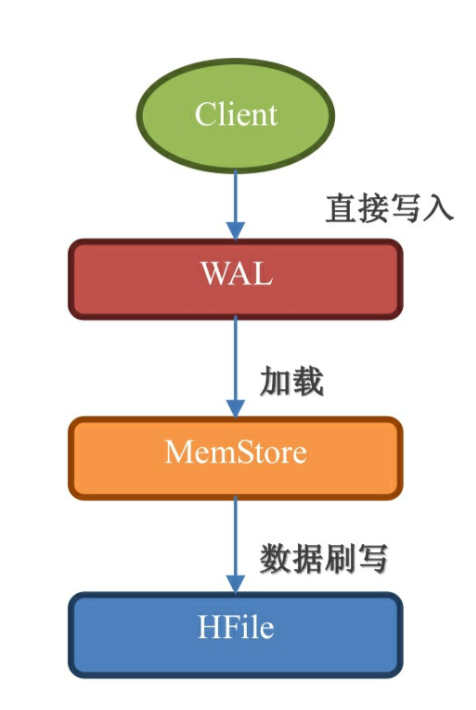
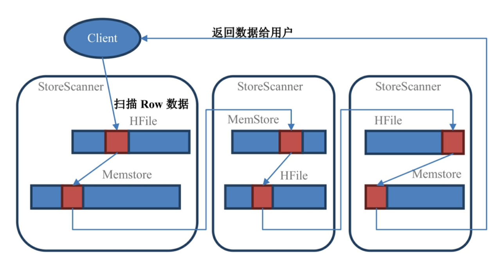

# 读写流程
## 1. 写
一个KeyValue被持久化到HDFS过程：

- **WAL** ：数据被发出后第一时间写入WAL。WAL是基于HDFS实现的，所以单元格已经被持久化，但是WAL只是一个暂存的日志，不区分Store。这些数据不能直接被读取和使用。
- **MemStore**：数据随后被立即放入Memstore中进行整理。MemStore会负责按照LSM树的结构来存放数据。
- **HFile**：最后，当Memstore太大达到阀值，或者达到了刷写时间间隔，HBase会把这个Memstore的内容刷写到HDFS系统上，HFile文件。

## 2. 读
先从BlockCache中找数据，找不到再去Memstore和HFile中查询数据。

墓碑标记和数据不在一个地方。在读取数据的时候，如果这个数据的墓碑标记更早被读到，是不会理科删除，只有在扫描器接着往下读，读到墓碑标记的时候才知道这个数据是被标记为删除的，不需要返回给用户。

所以HBase的Scan操作在取到所需要的所有行键对应的信息之后还会继续扫描下去，直到扫描的数据大于给出的限定条件为止，这样它才知道哪些数据应该返回给用户，哪些应该舍弃。

所以增加过滤条件也无法减少Scan遍历的行数，只有缩小STARTROW和ENDROW之间的行键范围才可以明显的加快扫描的速度。

在Scan扫描的时候store会创建StoreScanner实例。StoreScanner会把MemStore和HFile结合起来扫描。当StoreScanner打开的时候，会先定位到起始行键(STARTROW)上，然后开始往下扫描。

红色块是属于指定的row的数据，Scan要把所有符合条件的StoreScanner都扫描一遍之后才会返回数据给用户。
