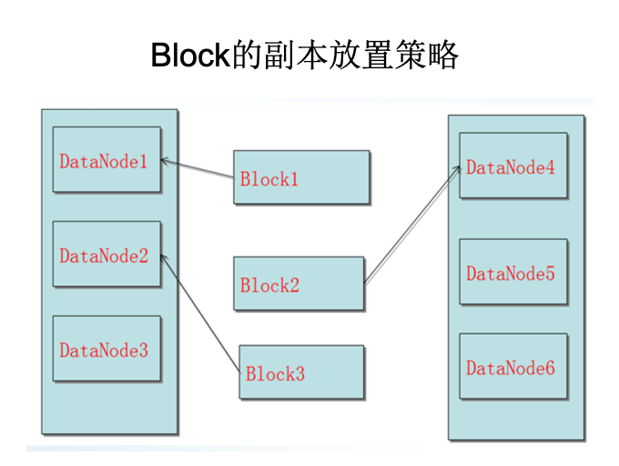

# HDFS Architecture

## 1. 简介
### 1.1 HDFS结构
分布式文件系统在物理结构上是由计算机集群中的多个节点构成的，这些节点分为两类，一类叫“主节点”(Master Node)或者也被称为“名称结点”(NameNode)，另一类叫“从节点”（Slave Node）或者也被称为“数据节点”(DataNode)。

### 1.2 HDFS简介
总体而言，HDFS要实现以下目标：
- 兼容廉价的硬件设备
- 流数据读写
- 大数据集
- 简单的文件模型
- 强大的跨平台兼容性

HDFS特殊的设计，在实现上述优良特性的同时，也使得自身具有一些应用局限性，主要包括以下几个方面：
- 不适合低延迟数据访问
- 无法高效存储大量小文件
- 不支持多用户写入及任意修改文件

### 1.3 Block
HDFS默认一个块在Hadoop2.x版本中是128M，老版本中是64M。一个文件被分成多个块，以块作为存储单位。

块的大小远远大于普通文件系统，可以最小化寻址开销。

HDFS采用抽象的块概念可以带来以下几个明显的好处：
- **支持大规模文件存储**：文件以块为单位进行存储，一个大规模文件可以被分拆成若干个文件块，不同的文件块可以被分发到不同的节点上，因此，一个文件的大小不会受到单个节点的存储容量的限制，可以远远大于网络中任意节点的存储容量
- **简化系统设计**：首先，大大简化了存储管理，因为文件块大小是固定的，这样就可以很容易计算出一个节点可以存储多少文件块；其次，方便了元数据的管理，元数据不需要和文件块一起存储，可以由其他系统负责管理元数据
- **适合数据备份**：每个文件块都可以冗余存储到多个节点上，大大提高了系统的容错性和可用性

## 2. NameNode

在HDFS中，名称节点（NameNode）负责管理分布式文件系统的命名空间（Namespace），保存了两个核心的数据结构，即FsImage和EditLog：
- FsImage用于维护文件系统树以及文件树中所有的文件和文件夹的元数据。
- 操作日志文件EditLog中记录了所有针对文件的创建、删除、重命名等操作。

名称节点记录了每个文件中各个块所在的数据节点的位置信息。

#### 2.1 FsImage文件
FsImage文件包含文件系统中所有目录和文件inode的序列化形式。每个inode是一个文件或目录的元数据的内部表示，并包含此类信息：文件的复制等级、修改和访问时间、访问权限、块大小以及组成文件的块。对于目录，则存储修改时间、权限和配额元数据。

FsImage文件没有记录块存储在哪个数据节点。而是由名称节点把这些映射保留在内存中，当数据节点加入HDFS集群时，数据节点会把自己所包含的块列表告知给名称节点，此后会定期执行这种告知操作，以确保名称节点的块映射是最新的。

#### 2.2 NameNode启动
在名称节点启动的时候，它会将FsImage文件中的内容加载到内存中，之后再执行EditLog文件中的各项操作，使得内存中的元数据和实际的同步，存在内存中的元数据支持客户端的读操作。

一旦在内存中成功建立文件系统元数据的映射，则创建一个新的FsImage文件和一个空的EditLog文件。

名称节点起来之后，HDFS中的更新操作会重新写到EditLog文件中，因为FsImage文件一般都很大（GB级别的很常见），如果所有的更新操作都往FsImage文件中添加，这样会导致系统运行的十分缓慢，但是，如果往EditLog文件里面写就不会这样，因为EditLog 要小很多。每次执行写操作之后，且在向客户端发送成功代码之前，edits文件都需要同步更新。

#### 2.3 SecondaryNameNode
##### 名称节点运行期间EditLog不断变大的问题
在名称节点运行期间，HDFS的所有更新操作都是直接写到EditLog中，久而久之， EditLog文件将会变得很大。

虽然这对名称节点运行时候是没有什么明显影响的，但是，当名称节点重启的时候，名称节点需要先将FsImage里面的所有内容映像到内存中，然后再一条一条地执行EditLog中的记录，当EditLog文件非常大的时候，会导致名称节点启动操作非常慢，而在这段时间内HDFS系统处于安全模式，一直无法对外提供写操作，影响了用户的使用。

**第二名称节点**是HDFS架构中的一个组成部分，它是用来保存名称节点中对HDFS 元数据信息的备份，并减少名称节点重启的时间。SecondaryNameNode一般是单独运行在一台机器上。

SecondaryNameNode的工作情况：
1. SecondaryNameNode会定期和NameNode通信，请求其停止使用EditLog文件，暂时将新的写操作写到一个新的文件edit.new上来，这个操作是瞬间完成，上层写日志的函数完全感觉不到差别；
2. SecondaryNameNode通过HTTP GET方式从NameNode上获取到FsImage和EditLog文件，并下载到本地的相应目录下；
3. SecondaryNameNode将下载下来的FsImage载入到内存，然后一条一条地执行EditLog文件中的各项更新操作，使得内存中的FsImage保持最新；这个过程就是EditLog和FsImage文件合并；
4. SecondaryNameNode执行完（3）操作之后，会通过post方式将新的FsImage文件发送到NameNode节点上
5. NameNode将从SecondaryNameNode接收到的新的FsImage替换旧的FsImage文件，同时将edit.new替换EditLog文件，通过这个过程EditLog就变小了

## 3. DataNode
`数据节点`是分布式文件系统HDFS的工作节点，负责数据的存储和读取，会根据客户端或者是名称节点的调度来进行数据的存储和检索，并且向名称节点定期发送自己所存储的块的列表。

每个数据节点中的数据会被保存在各自节点的本地Linux文件系统中。

## 4. HDFS体系结构
HDFS采用了主从（Master/Slave）结构模型，一个HDFS集群包括一个名称节点（NameNode）和若干个数据节点（DataNode）（如图所示）。名称节点作为中心服务器，负责管理文件系统的命名空间及客户端对文件的访问。集群中的数据节点一般是一个节点运行一个数据节点进程，负责处理文件系统客户端的读/写请求，在名称节点的统一调度下进行数据块的创建、删除和复制等操作。每个数据节点的数据实际上是保存在本地Linux文件系统中的。

### 4.1 HDFS命名空间管理
HDFS的命名空间包含目录、文件和块。

在HDFS1.0体系结构中，在整个HDFS集群中只有一个命名空间，并且只有唯一一个名称节点，该节点负责对这个命名空间进行管理。

HDFS使用的是传统的分级文件体系，因此，用户可以像使用普通文件系统一样，创建、删除目录和文件，在目录间转移文件，重命名文件等。

### 4.2	通信协议
HDFS是一个部署在集群上的分布式文件系统，因此，很多数据需要通过网络进行传输。
- 所有的HDFS通信协议都是构建在TCP/IP协议基础之上的。
- 客户端通过一个可配置的端口向名称节点主动发起TCP连接，并使用客户端协议与名称节点进行交互。
- 名称节点和数据节点之间则使用数据节点协议进行交互。
- 客户端与数据节点的交互是通过RPC（Remote Procedure Call）来实现的。在设计上，名称节点不会主动发起RPC，而是响应来自客户端和数据节点的RPC请求。

### 4.3	客户端
客户端是用户操作HDFS最常用的方式，HDFS在部署时都提供了客户端
- HDFS客户端是一个库，暴露了HDFS文件系统接口，这些接口隐藏了HDFS实现中的大部分复杂性
- 严格来说，客户端并不算是HDFS的一部分
- 客户端可以支持打开、读取、写入等常见的操作，并且提供了类似Shell的命令行方式来访问HDFS中的数据
- 此外，HDFS也提供了Java API，作为应用程序访问文件系统的客户端编程接口

### 4.4	HDFS体系结构的局限性
HDFS只设置唯一一个名称节点，这样做虽然大大简化了系统设计，但也带来了一些明显的局限性，具体如下：
- （1）**命名空间的限制**：名称节点是保存在内存中的，因此，名称节点能够容纳的对象（文件、块）的个数会受到内存空间大小的限制。
- （2）**性能的瓶颈**：整个分布式文件系统的吞吐量，受限于单个名称节点的吞吐量。
- （3）**隔离问题**：由于集群中只有一个名称节点，只有一个命名空间，因此，无法对不同应用程序进行隔离。
- （4）**集群的可用性**：一旦这个唯一的名称节点发生故障，会导致整个集群变得不可用。

## 5. HDFS存储原理
### 5.1 冗余数据保存
作为一个分布式文件系统，为了保证系统的容错性和可用性，HDFS采用了多副本方式对数据进行冗余存储，通常一个数据块的多个副本会被分布到不同的数据节点上，如图所示，数据块1被分别存放到数据节点A和C上，数据块2被存放在数据节点A和B上。这种多副本方式具有以下几个优点：
- （1）加快数据传输速度
- （2）容易检查数据错误
- （3）保证数据可靠性

### 5.2 数据存取策略
#### 5.1.1 数据存放
- 第一个副本：放置在上传文件的数据节点；如果是集群外提交，则随机挑选一台磁盘不太满、CPU不太忙的节点
- 第二个副本：放置在与第一个副本不同的机架的节点上
- 第三个副本：与第一个副本相同机架的其他节点上
- 更多副本：随机节点

#### 5.1.2 数据读取
HDFS提供了一个API可以确定一个数据节点所属的机架ID，客户端也可以调用API获取自己所属的机架ID。

当客户端读取数据时，从名称节点获得数据块不同副本的存放位置列表，列表中包含了副本所在的数据节点，可以调用API来确定客户端和这些数据节点所属的机架ID，当发现某个数据块副本对应的机架ID和客户端对应的机架ID相同时，就优先选择该副本读取数据，如果没有发现，就随机选择一个副本读取数据。

### 5.3 数据错误与恢复
HDFS具有较高的容错性，可以兼容廉价的硬件，它把硬件出错看作一种常态，而不是异常，并设计了相应的机制检测数据错误和进行自动恢复，主要包括以下几种情形：名称节点出错、数据节点出错和数据出错。

#### 5.3.1 名称节点出错
名称节点保存了所有的元数据信息，其中，最核心的两大数据结构是FsImage和Editlog，如果这两个文件发生损坏，那么整个HDFS实例将失效。因此，HDFS设置了备份机制，把这些核心文件同步复制到备份服务器SecondaryNameNode上。当名称节点出错时，就可以根据备份服务器SecondaryNameNode中的FsImage和Editlog数据进行恢复。

#### 5.3.2 数据节点出错
- 每个数据节点会定期向名称节点发送“心跳”信息，向名称节点报告自己的状态
- 当数据节点发生故障，或者网络发生断网时，名称节点就无法收到来自一些数据节点的心跳信息，这时，这些数据节点就会被标记为“宕机”，节点上面的所有数据都会被标记为“不可读”，名称节点不会再给它们发送任何I/O请求
- 这时，有可能出现一种情形，即由于一些数据节点的不可用，会导致一些数据块的副本数量小于冗余因子
- 名称节点会定期检查这种情况，一旦发现某个数据块的副本数量小于冗余因子，就会启动数据冗余复制，为它生成新的副本
- HDFS和其它分布式文件系统的最大区别就是可以调整冗余数据的位置

#### 5.3.3 数据出错
- 网络传输和磁盘错误等因素，都会造成数据错误
- 客户端在读取到数据后，会采用md5和sha1对数据块进行校验，以确定读取到正确的数据
- 在文件被创建时，客户端就会对每一个文件块进行信息摘录，并把这些信息写入到同一个路径的隐藏文件里面
- 当客户端读取文件的时候，会先读取该信息文件，然后，利用该信息文件对每个读取的数据块进行校验，如果校验出错，客户端就会请求到另外一个数据节点读取该文件块，并且向名称节点报告这个文件块有错误，名称节点会定期检查并且重新复制这个块
