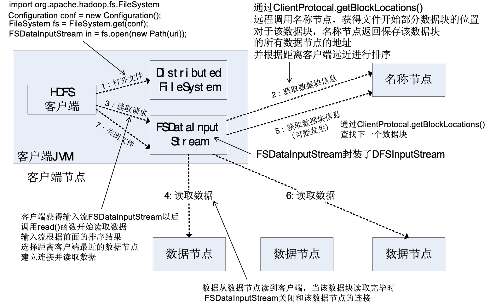
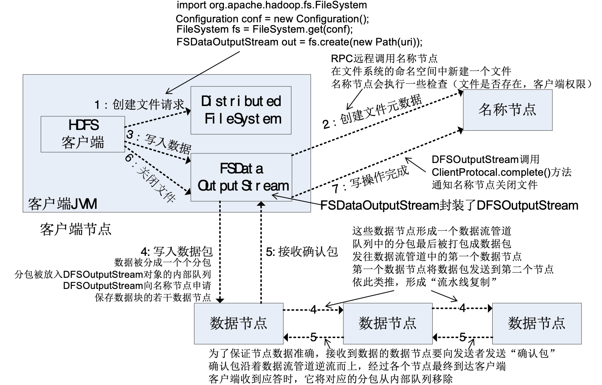

# Read && Write Process

## 1.概述
**读取文件**

```
public class Chapter3 {    
    public static void main(String[] args) {
        try {
            Configuration conf = new Configuration();  
            FileSystem fs = FileSystem.get(conf);
            Path filename = new Path(“hdfs://localhost:9000/user/hadoop/test.txt");
            FSDataInputStream is = fs.open(filename);            
            BufferedReader d = new BufferedReader(new InputStreamReader(is));
            String content = d.readLine(); //读取文件一行 
            System.out.println(content);
            d.close(); //关闭文件 
            fs.close(); //关闭hdfs 
        } catch (Exception e) {  
            e.printStackTrace();  
        }  
    }  
}

```

**写入文件**
```
public class Chapter3 {    
    public static void main(String[] args) { 
        try {
            Configuration conf = new Configuration();  
            FileSystem fs = FileSystem.get(conf);
            byte[] buff = "Hello world".getBytes(); // 要写入的内容 
            String filename = " hdfs://localhost:9000/user/hadoop/test.txt "; //要写入的文件名 
            FSDataOutputStream os = fs.create(new Path(filename));
            os.write(buff,0,buff.length);
            System.out.println("Create:"+ filename); 
        } catch (Exception e) {  
            e.printStackTrace();  
        }  
    }  
}
```

- `FileSystem`是一个通用文件系统的抽象基类，可以被分布式文件系统继承，所有可能使用Hadoop文件系统的代码，都要使用这个类。
- Hadoop为`FileSystem`这个抽象类提供了多种具体实现。
- `DistributedFileSystem`就是`FileSystem`在HDFS文件系统中的具体实现。
- `FileSystem`的`open()`方法返回的是一个输入流`FSDataInputStream`对象，在HDFS文件系统中，具体的输入流就是`DFSInputStream`；`FileSystem`中的`create()``方法返回的是一个输出流`FSDataOutputStream`对象，在HDFS文件系统中，具体的输出流就是`DFSOutputStream`。

```
Configuration conf = new Configuration();
FileSystem fs = FileSystem.get(conf);
FSDataInputStream in = fs.open(new Path(uri));
FSDataOutputStream out = fs.create(new Path(uri));
```

>**备注**：创建一个`Configuration`对象时，其构造方法会默认加载工程项目下两个配置文件，分别是`hdfs-site.xml`以及`core-site.xml`，这两个文件中会有访问HDFS所需的参数值，主要是`fs.defaultFS`，指定了HDFS的地址（比如`hdfs://localhost:9000`），有了这个地址客户端就可以通过这个地址访问HDFS了

## 2. 读数据过程


## 3. 写数据过程

