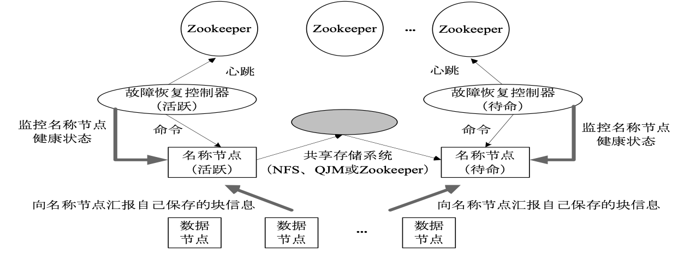
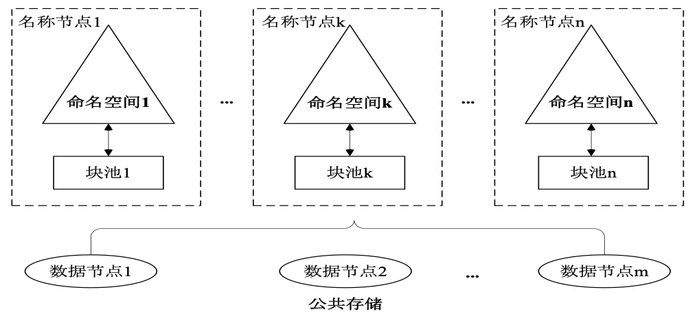
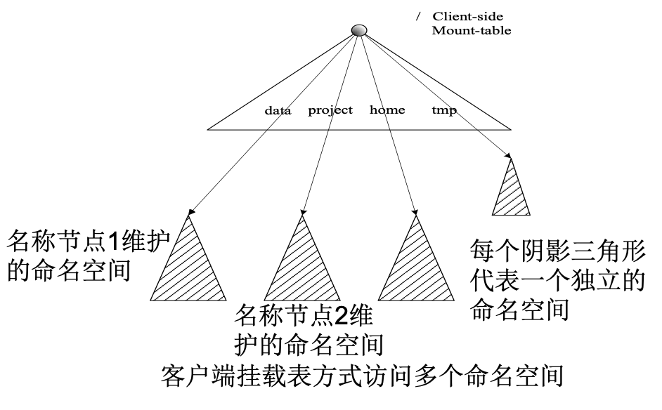

# HDFS HA

## 1. HDFS HA
- HDFS HA（High Availability）是为了解决单点故障问题。
- HA集群设置两个名称节点，“活跃（Active）”和“待命（Standby）”。
- 两种名称节点的状态同步，可以借助于一个共享存储系统来实现。
- Zookeeper确保一个名称节点在对外服务。
- 名称节点维护映射信息，数据节点同时向两个名称节点汇报信息。

## 2. HDFS Federation
### 2.1 HDFS1.0中存在的问题
- 单点故障问题
- 不可以水平扩展（是否可以通过纵向扩展来解决？）
- 系统整体性能受限于单个名称节点的吞吐量
- 单个名称节点难以提供不同程序之间的隔离性
- HDFS HA是热备份，提供高可用性，但是无法解决可扩展性、系统性能和隔离性

### 2.2 HDFS Federation的设计

在HDFS Federation中，设计了多个相互独立的名称节点，使得HDFS的命名服务能够水平扩展，这些名称节点分别进行各自命名空间和块的管理，相互之间是联盟（Federation）关系，不需要彼此协调。并且向后兼容。

HDFS Federation中，所有名称节点会共享底层的数据节点存储资源，数据节点向所有名称节点汇报。

属于同一个命名空间的块构成一个“块池”。

### 2.3 HDFS Federation的访问方式

- 对于Federation中的多个命名空间，可以采用客户端挂载表（Client Side Mount Table）方式进行数据共享和访问
- 客户可以访问不同的挂载点来访问不同的子命名空间

- 把各个命名空间挂载到全局“挂载表”（mount-table）中，实现数据全局共享
- 同样的命名空间挂载到个人的挂载表中，就成为应用程序可见的命名空间

### 2.4 HDFS Federation相对于HDFS1.0的优势
HDFS Federation设计可解决单名称节点存在的以下几个问题：
- （1）HDFS集群扩展性。多个名称节点各自分管一部分目录，使得一个集群可以扩展到更多节点，不再像HDFS1.0中那样由于内存的限制制约文件存储数目
- （2）性能更高效。多个名称节点管理不同的数据，且同时对外提供服务，将为用户提供更高的读写吞吐率
- （3）良好的隔离性。用户可根据需要将不同业务数据交由不同名称节点管理，这样不同业务之间影响很小

需要注意的，HDFS Federation并不能解决单点故障问题，也就是说，每个名称节点都存在在单点故障问题，需要为每个名称节点部署一个后备名称节点，以应对名称节点挂掉对业务产生的影响
