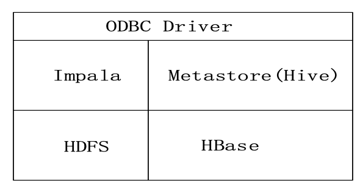
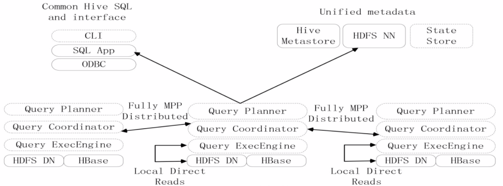
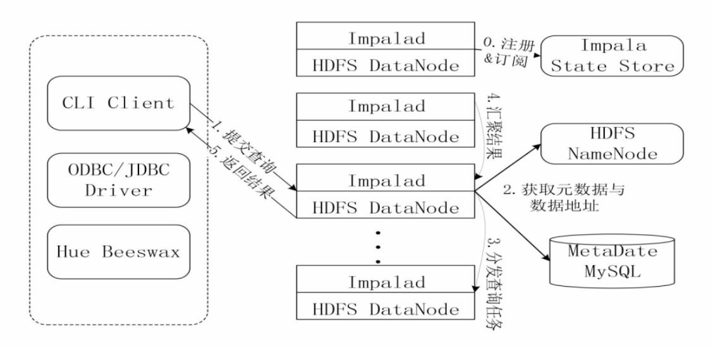

# Introduce
## 1. 简介
- Impala是由Cloudera公司开发的新型查询系统，它提供SQL语义，能查询存储在Hadoop的HDFS和HBase上的PB级大数据，在性能上比Hive高出3~30倍
- Impala的运行需要依赖于Hive的元数据
- Impala是参照 Dremel系统进行设计的
- Impala采用了与商用并行关系数据库类似的分布式查询引擎，可以直接与HDFS和HBase进行交互查询
- Impala和Hive采用相同的SQL语法、ODBC驱动程序和用户接口

## 2. Architecture
Impala和Hive、HDFS、HBase等工具是统一部署在一个Hadoop平台上的。
Impala主要由Impalad，State Store和CLI三部分组成。

Impala主要由Impalad，State Store和CLI三部分组成

#### ① Impalad
- 负责协调客户端提交的查询的执行
- 包含Query Planner、Query Coordinator和Query Exec Engine三个模块
- 与HDFS的数据节点（HDFS DN）运行在同一节点上
- 给其他Impalad分配任务以及收集其他Impalad的执行结果进行汇总
- Impalad也会执行其他Impalad给其分配的任务，主要就是对本地HDFS和HBase里的部分数据进行操作
-
#### ② State Store
- 会创建一个statestored进程
- 负责收集分布在集群中各个Impalad进程的资源信息，用于查询调度
-
#### ③ CLI
- 给用户提供查询使用的命令行工具
- 还提供了Hue、JDBC及ODBC的使用接口

>**说明**：Impala中的元数据直接存储在Hive中。Impala采用与Hive相同的元数据、SQL语法、ODBC驱动程序和用户接口，从而使得在一个Hadoop平台上，可以统一部署Hive和Impala等分析工具，同时支持批处理和实时查询

## 3. Impala查询执行过程

## 4. Impala与Hive比较
