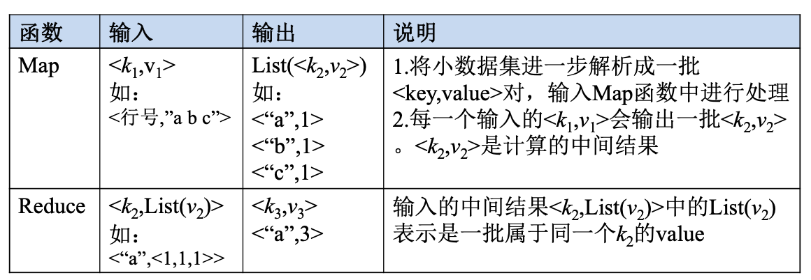
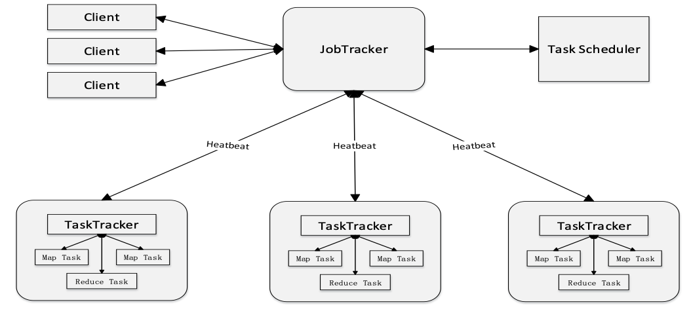
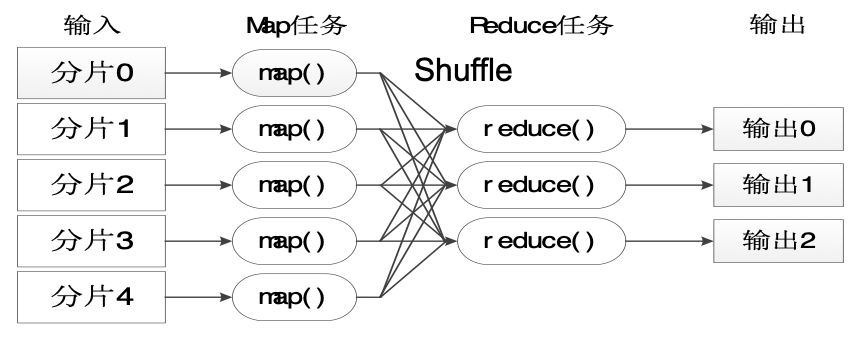
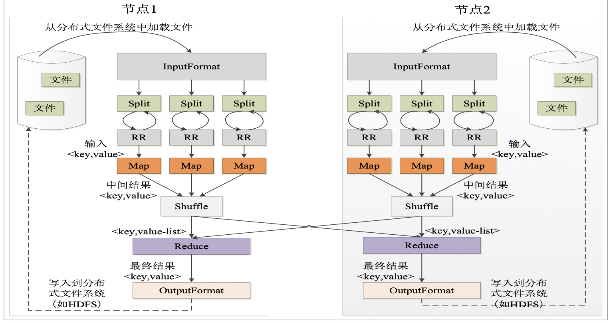
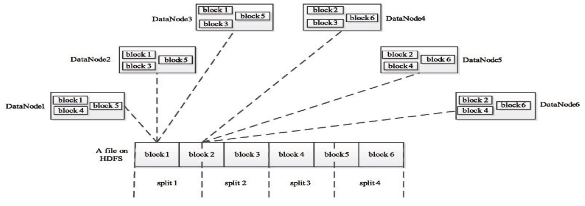
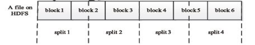
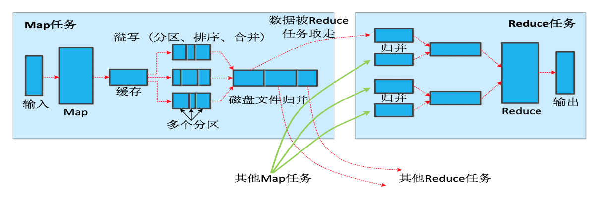
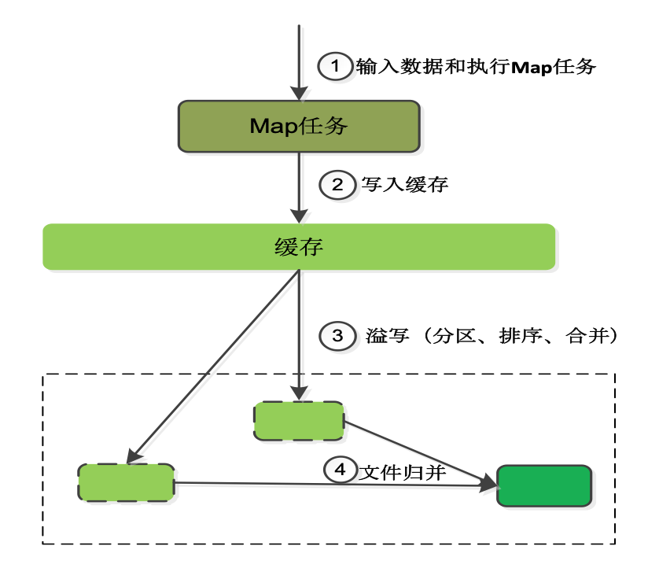
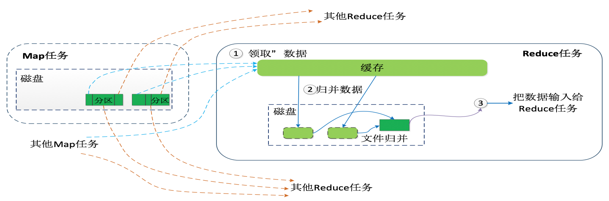

#  Architecture

## 1. Introduce
- MapReduce将复杂的、运行于大规模集群上的并行计算过程高度地抽象到了两个函数：Map和Reduce
编程容易，不需要掌握分布式并行编程细节，也可以很容易把自己的程序运行在分布式系统上，完成海量数据的计算
- MapReduce采用“分而治之”策略，一个存储在分布式文件系统中的大规模数据集，会被切分成许多独立的分片（split），这些分片可以被多个Map任务并行处理
- MapReduce设计的一个理念就是“计算向数据靠拢”，而不是“数据向计算靠拢”，因为，移动数据需要大量的网络传输开销
- MapReduce框架采用了Master/Slave架构，包括一个Master和若干个Slave。Master上运行JobTracker，Slave上运行TaskTracker
- Hadoop框架是用Java实现的，但是，MapReduce应用程序则不一定要用Java来写

### 1.2 Map和Reduce函数

## 2.  MR体系结构
MapReduce体系结构主要由四个部分组成，分别是：Client、JobTracker、TaskTracker以及Task

### 2.1 MapReduce主要有以下4个部分组成：
#### 1）Client
- 用户编写的MapReduce程序通过Client提交到JobTracker端
- 用户可通过Client提供的一些接口查看作业运行状态

#### 2）JobTracker
- JobTracker 负责资源监控和作业调度
- JobTracker 监控所有TaskTracker与Job的健康状况，一旦发现失败，就将相应的任务转移到其他节点
- JobTracker 会跟踪任务的执行进度、资源使用量等信息，并将这些信息告诉任务调度器（TaskScheduler），而调度器会在资源出现空闲时，选择合适的任务去使用这些资源

#### 3）TaskTracker
- TaskTracker 会周期性地通过“心跳”将本节点上资源的使用情况和任务的运行进度汇报给JobTracker，同时接收JobTracker 发送过来的命令并执行相应的操作（如启动新任务、杀死任务等）
- TaskTracker 使用“slot”等量划分本节点上的资源量（CPU、内存等）。一个Task 获取到一个slot 后才有机会运行，而Hadoop调度器的作用就是将各个TaskTracker上的空闲slot分配给Task使用。slot 分为Map slot 和Reduce slot 两种，分别供MapTask 和Reduce Task 使用

#### 4）Task
Task 分为Map Task 和Reduce Task 两种，均由TaskTracker 启动

## 3. 工作流程
 

 - 不同的Map任务之间不会进行通信
 - 不同的Reduce任务之间也不会发生任何信息交换
 - 用户不能显式地从一台机器向另一台机器发送消息
 - 所有的数据交换都是通过MapReduce框架自身去实现的

### 3.1 执行阶段

Split是逻辑切分，标记分片起始和结束位置，不是物理分割。

RR：Record Reader 记录阅读器。

### 3.2 分片(split)

HDFS 以固定大小的block 为基本单位存储数据，而对于MapReduce 而言，其处理单位是split。split 是一个逻辑概念，它只包含一些元数据信息，比如数据起始位置、数据长度、数据所在节点等。它的划分方法完全由用户自己决定。

#### Map任务的数量
Hadoop为每个split创建一个Map任务，split 的多少决定了Map任务的数目。大多数情况下，理想的分片大小是一个HDFS块

#### Reduce任务的数量
- 最优的Reduce任务个数取决于集群中可用的reduce任务槽(slot)的数目
- 通常设置比reduce任务槽数目稍微小一些的Reduce任务个数（这样可以预留一些系统资源处理可能发生的错误）

## 4. Shuffle

### 4.1 Map端的Shuffle过程

- 每个Map任务分配一个缓存
- MapReduce默认100MB缓存

- 设置溢写比例0.8
- 分区默认采用哈希函数
- 排序是默认的操作
- 排序后可以合并（Combine）
- 合并不能改变最终结果

- 在Map任务全部结束之前进行归并
- 归并得到一个大的文件，放在本地磁盘
- 文件归并时，如果溢写文件数量大于预定值（默认是3）则可以再次启动Combiner，少于3不需要
- JobTracker会一直监测Map任务的执行，并通知Reduce任务来领取数据

**合并（Combine）和归并（Merge）的区别**：
两个键值对<“a”,1>和<“a”,1>，如果合并，会得到<“a”,2>，如果归并，会得到<“a”,<1,1>>

### 4.2 Reduce端的Shuffle过程

- Reduce任务通过RPC向JobTracker询问Map任务是否已经完成，若完成，则领取数据
- Reduce领取数据先放入缓存，来自不同Map机器，先归并，再合并，写入磁盘
- 多个溢写文件归并成一个或多个大文件，文件中的键值对是排序的
- 当数据很少时，不需要溢写到磁盘，直接在缓存中归并，然后输出给Reduce
