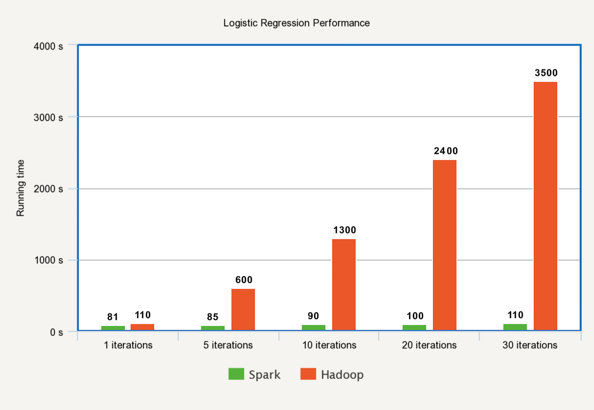
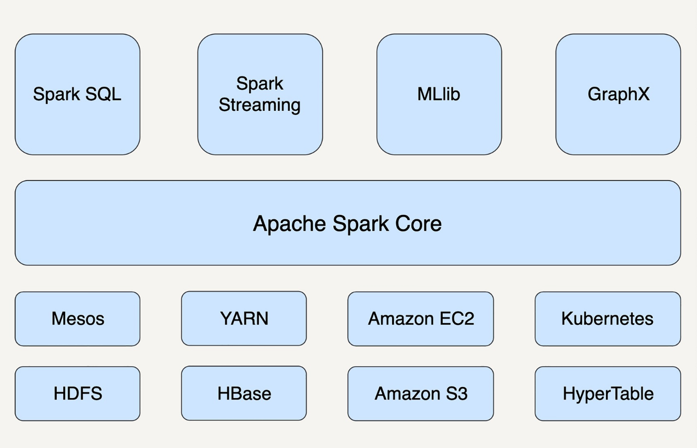

# 我们为什么需要Spark？
2009年诞生于没过加州大学伯克利分校AMP实验室。
2013年成为ASF旗下孵化项目。

## MapReduce缺陷
缺点：
- MR抽象层次太低，大量底层逻辑需要开发者手工完成。
- 只提供Map和Reduce两个操作。
- 每步计算都要进行硬盘的读取和写入，大大增加系统延迟。
- 只支持批处理不支持流处理

## Spark优势
最基本数据抽象：RDD（Resilient Distributed Dataset）,代表一个可被分区(partition)的只读数据集，内部有很多分区，每个分区有大量记录（record）。

Databricks 团队曾经做过一个实验，他们用 Spark 排序一个 100TB 的静态数据集仅仅用时 23 分钟。而之前用 Hadoop 做到的最快记录也用了高达 72 分钟。此外，Spark 还只用了 Hadoop 所用的计算资源的 1/10，耗时只有 Hadoop 的 1/3。

Spark每一步计算结果缓存在内存中，适合迭代算法。

MR和Spark运行逻辑回归时间对比：

Hadoop 做每一次迭代运算的时间基本相同，而 Spark除了第一次载入数据到内存以外，别的迭代时间基本可以忽略。

在任务（task）级别上，Spark 的并行机制是多线程模型，而 MapReduce 是多进程模型。多进程模型便于细粒度控制每个任务占用的资源，但会消耗较多的启动时间。而 Spark 同一节点上的任务以多线程的方式运行在一个 JVM 进程中，可以带来更快的启动速度、更高的 CPU 利用利用率，以及更好的内存共享。

从狭义上来看，Spark 只是 MapReduce 的替代方案，大部分应用场景中，它还要依赖于HDFS 和 HBase 来存储数据，依赖于 YARN 来管理集群和资源。

Spark 并不是一定要依附于 Hadoop 才能生存，它还可以运行在 Apache Mesos、Kubernetes、standalone 等其他云平台上。

作为通用的数据处理平台，Spark 有五个主要的扩展库，分别是支持结构化数据的Spark SQL、处理实时数据的 Spark Streaming、用于机器学习的 MLlib、用于图计算的GraphX、用于统计分析的 SparkR。
