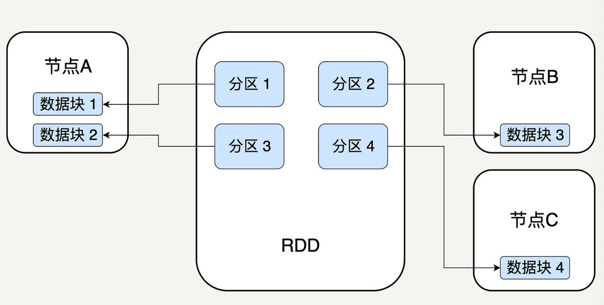
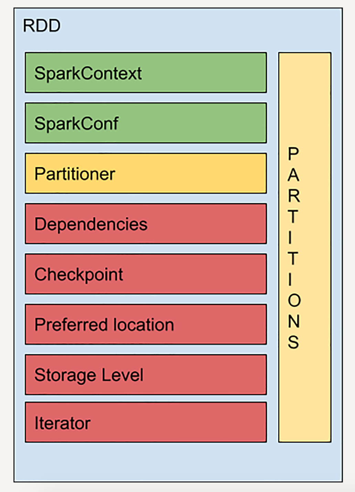
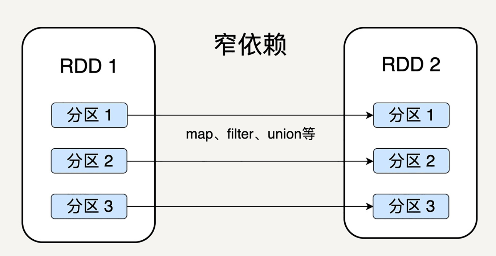
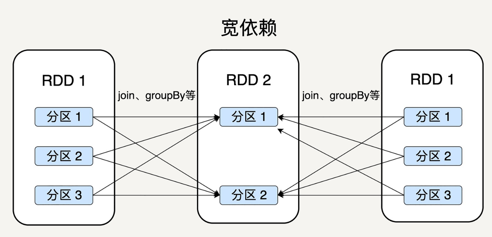

# RDD
## Why RDD?
MR慢是因为DAG的中间计算结果要落盘防止运行结果丢失。

## RDD定义
RDD表示已被分区、不可变的，并能够被并行操作的数据集合。
### 分区
分区代表同一个 RDD 包含的数据被存储在系统的不同节点中，这也是它可以被并行处理的前提。

- 逻辑上，我们可以认为 RDD 是一个大的数组。数组中的每个元素代表一个分区（Partition）。
- 在物理存储中，每个分区指向一个存放在内存或者硬盘中的数据块（Block），而这些数据块是独立的，它们可以被存放在系统中的不同节点。

RDD 只是抽象意义的数据集合，分区内部并不会存储具体的数据。


RDD分区对应index。RDD的ID与分区的index唯一对应。

各节点数据块存放在内存，内存没有空间存入硬盘。

RDD存储数据只读，但是可以修改分区数量。

### 不可变性
RDD是只读的，所包含的分区信息不可改变。但可对现有RDD转换(transformation)操作，得到新的RDD。
RDD与函数式编程的Collection很相似。
```
//读入文本data.txt
lines = sc.textFile("data.txt")
//创建RDD lineLengths，获取每一行字数
lineLengths = lines.map(lambda s: len(s))
//获取文本总字数
totalLength = lineLengths.reduce(lambda a, b: a + b)
```

**依赖关系**：记录中间结果RDD，提升Spark计算效率，错误恢复更容易。第N步错，只需从N-1个RDD开始恢复。

### 并行操作
由于单个RDD分区特性，支持并发，不同节点的数据可被分别处理然后产生新的RDD。

## RDD结构


**SparkContext**:
SparkContext 是所有 Spark 功能的入口，它代表了与 Spark 节点的连接，可以用来创建
RDD 对象以及在节点中的广播变量等。一个线程只有一个 SparkContext。

## 依赖关系
Spark 不需要将每个中间计算结果进行数据复制以防数据丢失，因为每一步产生的 RDD 里都会存储它的依赖关系，即它是通过哪个 RDD 经过哪个转换操作得到的。

窄依赖允许子 RDD 的每个分区可以被并行处理产生，而宽依赖则必须等父 RDD 的所有分区都被计算好之后才能开始处理。

### 窄依赖
父 RDD 的分区可以一一对应到子 RDD 的分区，


### 宽依赖
父 RDD 的每个分区可以被多个子 RDD 的分区使用。


一些转换操作如 map、filter 会产生窄依赖关系，而 Join、groupBy 则会生成宽依赖关系。

map 是将分区里的每一个元素通过计算转化为另一个元素，一个分区里的数据不会跑到两个不同的分区。而 groupBy 则要将拥有所有分区里有相同 Key 的元素放到同一个目标分区，而每一个父分区都可能包含各种 Key 的元素，所以它可能被任意一个子分区所依赖。

### 如此设计的原因
窄依赖可以支持在同一个节点上链式执行多条命令，例如在执行了 map 后，紧接着执行filter。相反，宽依赖需要所有的父分区都是可用的，可能还需要调用类似 MapReduce之类的操作进行跨节点传递。

从失败恢复的角度考虑，窄依赖的失败恢复更有效，因为它只需要重新计算丢失的父分区即可，而宽依赖牵涉到 RDD 各级的多个父分区。

## 总结
弹性分布式数据集作为 Spark 的基本数据抽象，相较于 Hadoop/MapReduce 的数据模型而言，各方面都有很大的提升。

大提升了数据容错性和错误恢复的正确率，使 Spark 更加可靠。

## Q&A 1
Q:窄依赖是指父 RDD 的每一个分区都可以唯一对应子 RDD 中的分区，那么是否意味着子RDD 中的一个分区只可以对应父 RDD 中的一个分区呢？
A:不是。窄依赖的父RDD必须有一个对应的子RDD，也就是说父RDD的一个分区只能被子RDD一个分区使用，但是反过来子RDD的一个分区可以使用父RDD的多个分区。


Q:如果子 RDD 的一个分区需要由父RDD 中若干个分区计算得来，是否还算窄依赖？
A:算。只有当子RDD分区依赖的父RDD分区不被其他子RDD分区依赖，这样的计算就是窄依赖，否则是宽依赖。

## RDD结构
### Checkpoint
计算过程中，耗时的RDD可以缓存到硬盘或者HDFS，标记这个RDD被检查点处理过，并清空依赖关系，新建依赖于CheckpointRDD的依赖关系。

CheckpointRDD可以用来从硬盘中读取RDD和生成新的分区信息。当某个子 RDD 需要错误恢复时，回溯至该 RDD，发现它被检查点记录过，就可以直接去硬盘中读取这个 RDD，而无需再向前回溯计算。

### Storage Level
- MEMORY_ONLY:默认。只缓存在内存中，如果内存空间不够则不缓存多出来的部分。
- MEMORY_AND_DISK：缓存在内存中，如果空间不够则缓存在硬盘中。
- DISK_ONLY：只缓存在硬盘中。
- MEMORY_ONLY_2 和 MEMORY_AND_DISK_2 等：与上面的级别功能相同，只不过每个分区在集群中两个节点上建立副本。

### Iterator
迭代函数（Iterator）和计算函数（Compute）是用来表示 RDD 怎样通过父 RDD 计算得到的。

迭代函数会首先判断缓存中是否有想要计算的 RDD，如果有就直接读取，如果没有，就查数向上递归，查找父 RDD 进行计算。
