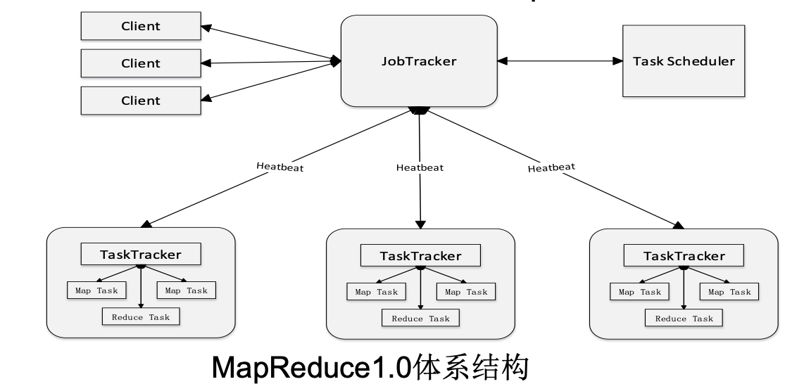
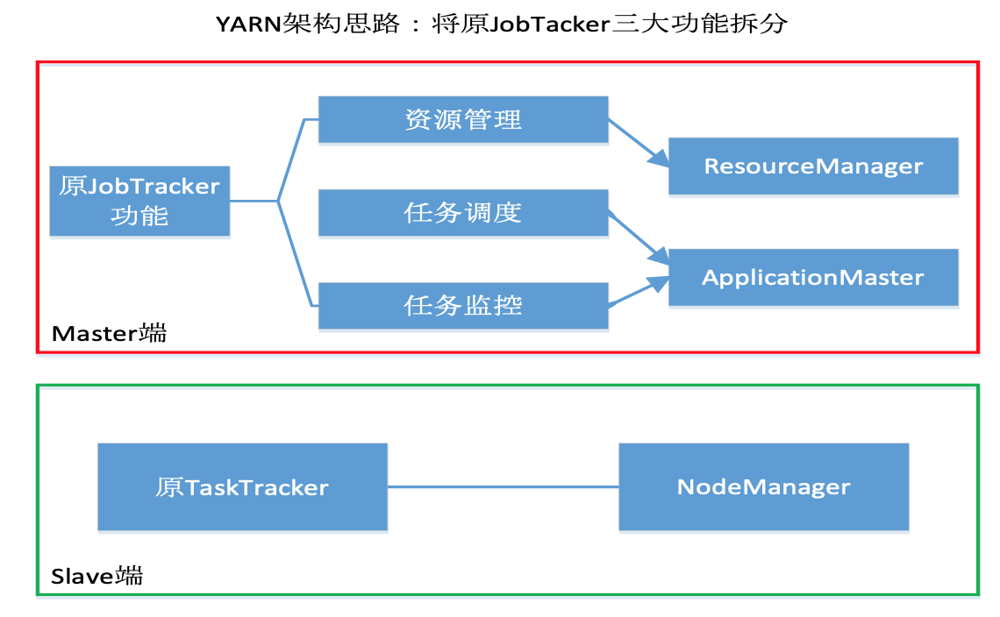
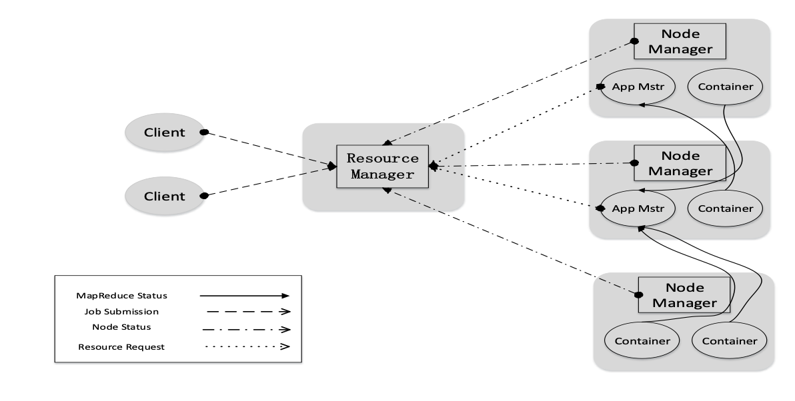
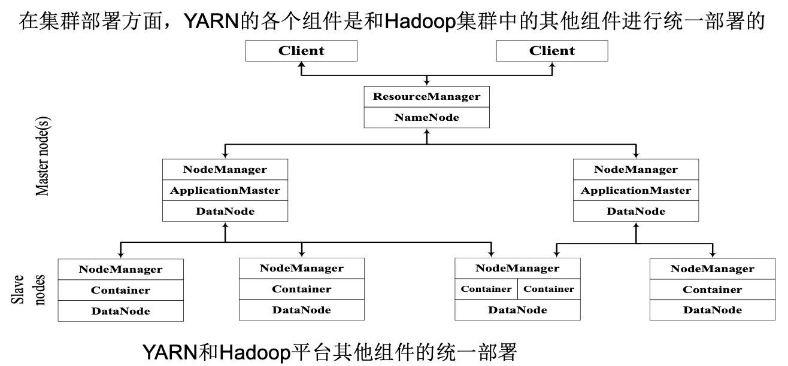
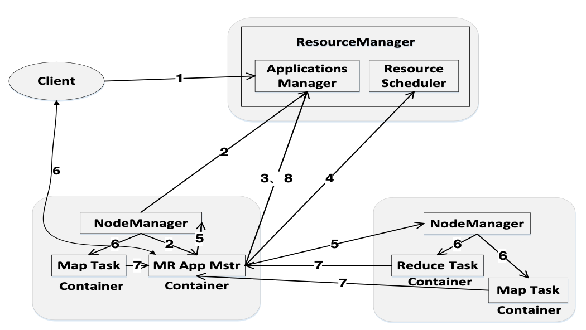

# YARN Introduce

## 1. MapReduce1.0缺陷
- （1）存在单点故障
- （2）JobTracker“大包大揽”导致任务过重（任务多时内存开销大，上限4000节点）
- （3）容易出现内存溢出（分配资源只考虑MapReduce任务数，不考虑CPU、内存）
- （4）资源划分不合理（强制划分为slot ，包括Map slot和Reduce slot）

## 2. YARN体系结构

- MapReduce1.0既是一个计算框架，也是一个资源管理调度框架
- 到了Hadoop2.0以后，MapReduce1.0中的资源管理调度功能，被单独分离出来形成了YARN，它是一个纯粹的资源管理调度框架，而不是一个计算框架
- 被剥离了资源管理调度功能的MapReduce 框架就变成了MapReduce2.0，它是运行在YARN之上的一个纯粹的计算框架，不再自己负责资源调度管理服务，而是由YARN为其提供资源管理调度服务

##### ResourceManager
- 处理客户端请求
- 启动/监控ApplicationMaster
- 监控NodeManager
- 资源分配与调度

##### ApplicationMaster
- 为应用程序申请资源，并分配给内部任务
- 任务调度、监控与容错

##### NodeManager
- 单个节点上的资源管理
- 处理来自ResourceManger的命令
- 处理来自ApplicationMaster的命令

### 2.1 ResourceManager
ResourceManager（RM）是一个全局的资源管理器，负责整个系统的资源管理和分配，主要包括两个组件，即调度器（Scheduler）和应用程序管理器（Applications Manager）。

调度器接收来自ApplicationMaster的应用程序资源请求，把集群中的资源以“容器”的形式分配给提出申请的应用程序，容器的选择通常会考虑应用程序所要处理的数据的位置，进行就近选择，从而实现“计算向数据靠拢”。

容器（Container）作为动态资源分配单位，每个容器中都封装了一定数量的CPU、内存、磁盘等资源，从而限定每个应用程序可以使用的资源量。

调度器被设计成是一个可插拔的组件，YARN不仅自身提供了许多种直接可用的调度器，也允许用户根据自己的需求重新设计调度器。

应用程序管理器（Applications Manager）负责系统中所有应用程序的管理工作，主要包括应用程序提交、与调度器协商资源以启动ApplicationMaster、监控ApplicationMaster运行状态并在失败时重新启动等。

### 2.2 ApplicationMaster
ResourceManager接收用户提交的作业，按照作业的上下文信息以及从NodeManager收集来的容器状态信息，启动调度过程，为用户作业启动一个ApplicationMaster。

ApplicationMaster的主要功能是：
- （1）当用户作业提交时，ApplicationMaster与ResourceManager协商获取资源，ResourceManager会以容器的形式为ApplicationMaster分配资源；
- （2）把获得的资源进一步分配给内部的各个任务（Map任务或Reduce任务），实现资源的“二次分配”；
- （3）与NodeManager保持交互通信进行应用程序的启动、运行、监控和停止，监控申请到的资源的使用情况，对所有任务的执行进度和状态进行监控，并在任务发生失败时执行失败恢复（即重新申请资源重启任务）；
- （4）定时向ResourceManager发送“心跳”消息，报告资源的使用情况和应用的进度信息；
- （5）当作业完成时，ApplicationMaster向ResourceManager注销容器，执行周期完成。

### 2.3 NodeManager
NodeManager是驻留在一个YARN集群中的每个节点上的代理，主要负责：
- 容器生命周期管理
- 监控每个容器的资源（CPU、内存等）使用情况
- 跟踪节点健康状况
- 以“心跳”的方式与ResourceManager保持通信
- 向ResourceManager汇报作业的资源使用情况和每个容器的运行状态
- 接收来自ApplicationMaster的启动/停止容器的各种请求

需要说明的是，NodeManager主要负责管理抽象的容器，只处理与容器相关的事情，而不具体负责每个任务（Map任务或Reduce任务）自身状态的管理，因为这些管理工作是由ApplicationMaster完成的，ApplicationMaster会通过不断与NodeManager通信来掌握各个任务的执行状态。

### 2.4 集群部署
在集群部署方面，YARN的各个组件是和Hadoop集群中的其他组件进行统一部署的。

## 3. YARN工作流程

- 步骤1：用户编写客户端应用程序，向YARN提交应用程序，提交的内容包括ApplicationMaster程序、启动ApplicationMaster的命令、用户程序等
- 步骤2：YARN中的ResourceManager负责接收和处理来自客户端的请求，为应用程序分配一个容器，在该容器中启动一个ApplicationMaster
- 步骤3：ApplicationMaster被创建后会首先向ResourceManager注册
- 步骤4：ApplicationMaster采用轮询的方式向ResourceManager申请资源
- 步骤5：ResourceManager以“容器”的形式向提出申请的ApplicationMaster分配资源
- 步骤6：在容器中启动任务（运行环境、脚本）
- 步骤7：各个任务向ApplicationMaster汇报自己的状态和进度
- 步骤8：应用程序运行完成后，ApplicationMaster向ResourceManager的应用程序管理器注销并关闭自己

## 4. YARN与MR1.0对比
从MapReduce1.0框架发展到YARN框架，客户端并没有发生变化，其大部分调用API及接口都保持兼容，因此，原来针对Hadoop1.0开发的代码不用做大的改动，就可以直接放到Hadoop2.0平台上运行。

总体而言，YARN相对于MapReduce1.0来说具有以下优势：
- 大大减少了承担中心服务功能的ResourceManager的资源消耗
- ApplicationMaster来完成需要大量资源消耗的任务调度和监控
- 多个作业对应多个ApplicationMaster，实现了监控分布化

- MapReduce1.0既是一个计算框架，又是一个资源管理调度框架，但是，只能支持MapReduce编程模型。而YARN则是一个纯粹的资源调度管理框架，在它上面可以运行包括MapReduce在内的不同类型的计算框架，只要编程实现相应的ApplicationMaster

- YARN中的资源管理比MapReduce1.0更加高效
