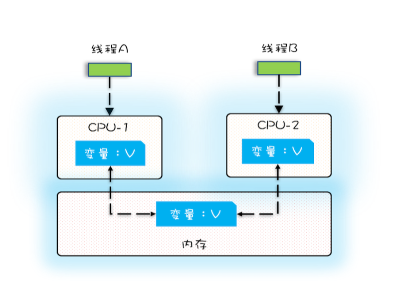
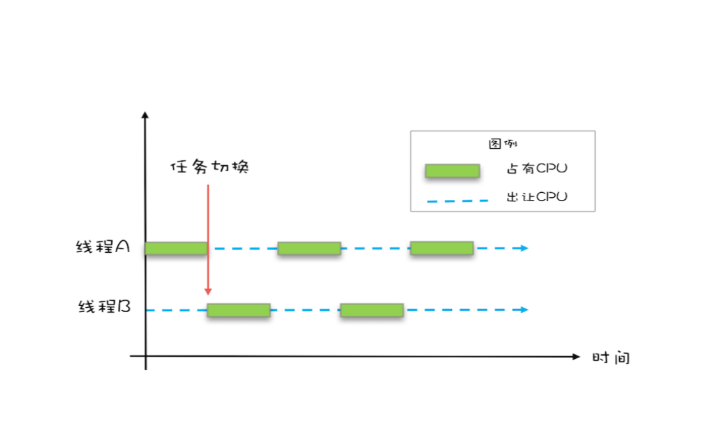
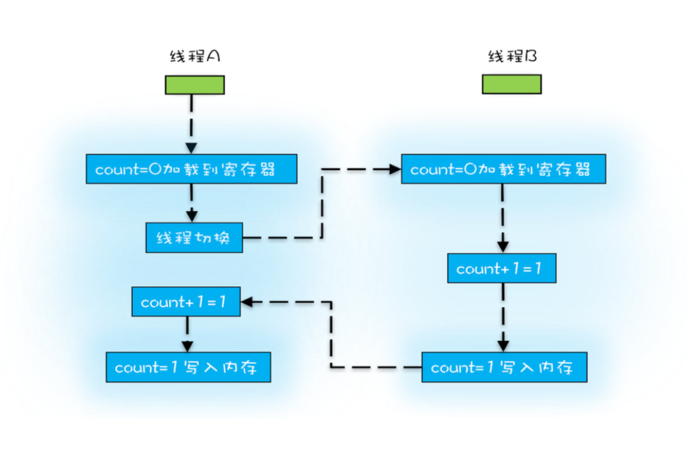
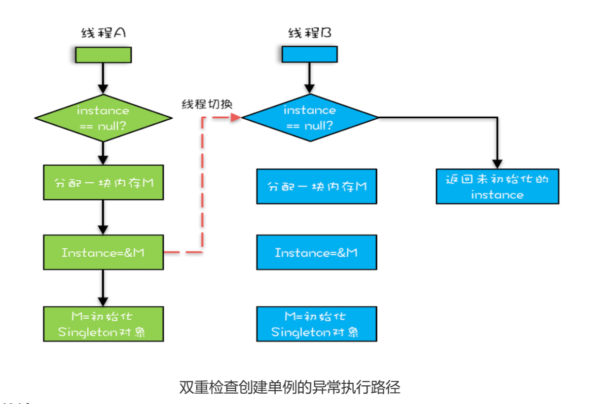

## 1. 并发幕后
并发的核心矛盾是CPU、内存、I/O设备的速度差异。

为了合理利用 CPU 的高性能，平衡这三者的速度差异，计算机体系机构、操作系统、编译 程序都做出了贡献，主要体现为:
1. CPU 增加了缓存，以均衡与内存的速度差异;
2. 操作系统增加了进程、线程，以分时复用CPU，进而均衡 CPU 与 I/O 设备的速度差异;
3. 编译程序优化指令执行次序，使得缓存能够得到更加合理地利用。

## 2. 缓存导致的可见性问题


多核时代，每颗 CPU 都有自己的缓存，这时 CPU 缓存与内存的数据一致性就没那么容易 解决了，当多个线程在不同的 CPU 上执行时，这些线程操作的是不同的 CPU 缓存。比如 下图中，线程 A 操作的是 CPU-1 上的缓存，而线程 B 操作的是 CPU-2 上的缓存，很明 显，这个时候线程 A 对变量 V 的操作对于线程 B 而言就不具备可见性了。

## 3. 线程切换导致的原子性问题

我们把一个或者多个操作在 CPU 执行的过程中不被中断的特性称为**原子性**。

### 3.1 时间片
操作系统允许某个进程执行一小段时间，例如 50 毫秒，过了 50 毫秒操作系统就会重新选 择一个进程来执行(我们称为“任务切换”)，这个 50 毫秒称为“**时间片**”。


线程切换示意图
在一个时间片内，如果一个进程进行一个 IO 操作，例如读个文件，这个时候该进程可以 把自己标记为“休眠状态”并出让 CPU 的使用权，待文件读进内存，操作系统会把这个休 眠的进程唤醒，唤醒后的进程就有机会重新获得 CPU 的使用权了。

这里的进程在等待 IO 时之所以会释放 CPU 使用权，是为了让 CPU 在这段等待时间里可 以做别的事情，这样一来 CPU 的使用率就上来了;此外，如果这时有另外一个进程也读文 件，读文件的操作就会排队，磁盘驱动在完成一个进程的读操作后，发现有排队的任务， 就会立即启动下一个读操作，这样 IO 的使用率也上来了。

### 3.2 Java的线程切换
高级语言里一条语句往往需要多条 CPU 指令完成，例 如上面代码中的count += 1，至少需要三条 CPU 指令：
- 指令 1:首先，需要把变量 count 从内存加载到 CPU 的寄存器;
- 指令 2:之后，在寄存器中执行 +1 操作;
- 指令 3:最后，将结果写入内存(缓存机制导致可能写入的是 CPU 缓存而不是内存)。

操作系统做任务切换，可以发生在任何一条CPU 指令执行完，而不是高级语言里的一条语句。对于上面的三条指令来说，我们假设 count=0，如果线程 A 在指令 1 执行完后做线程切换，线程 A 和线程 B 按照下图的序列执行，那么我们会发现 两个线程都执行了 count+=1 的操作，但是得到的结果不是我们期望的 2，而是 1。



CPU 能保证的原子操作是 CPU 指令级别的，而不是高级语言的操作符，这是违背我们直觉的地方。因此，很多时候我们需要在高级语言层面保证操作的原子性。

## 4. 编译优化带来的有序性问题
有序性指的是程序按照代码的先后顺序执行。编译器为了优化性能，有时候会改 变程序中语句的先后顺序，例如程序中:“a=6;b=7;”编译器优化后可能变 成“b=7;a=6;”，在这个例子中，编译器调整了语句的顺序，但是不影响程序的最终结果。

### 4.1 双重检查
```
public class Singleton {
  static Singleton instance;

  static Singleton getInstance(){
    if (instance == null) {
      synchronized(Singleton.class) {
        if (instance == null){
          instance = new Singleton();
        }
      }
      return instance;
  }
 }
```

设有两个线程 A、B 同时调用 getInstance() 方法，他们会同时发现 instance == null ，于是同时对 Singleton.class 加锁，此时 JVM 保证只有一个线程能够加锁成功
(假设是线程 A)，另外一个线程则会处于等待状态(假设是线程 B);线程 A 会创建一 个 Singleton 实例，之后释放锁，锁释放后，线程 B 被唤醒，线程 B 再次尝试加锁，此 时是可以加锁成功的，加锁成功后，线程 B 检查 instance == null 时会发现，已经创 建过 Singleton 实例了，所以线程 B 不会再创建一个 Singleton 实例。

这看上去一切都很完美，无懈可击，但实际上这个 getInstance() 方法并不完美。问题出 在哪里呢?出在 new 操作上，我们以为的 new 操作应该是:
1. 分配一块内存 M;
2. 在内存 M 上初始化 Singleton 对象; 
3. 然后 M 的地址赋值给 instance 变量。

但是实际上优化后的执行路径却是这样的:

1. 分配一块内存 M;
2. 将 M 的地址赋值给 instance 变量;
3. 最后在内存 M 上初始化 Singleton 对象。

优化后会导致什么问题呢?我们假设线程 A 先执行 getInstance() 方法，当执行完指令 2 时恰好发生了线程切换，切换到了线程 B 上;如果此时线程 B 也执行 getInstance() 方 法，那么线程 B 会发现instance != null，所以直接返回 instance，而此时的 instance 是没有初始化过的，如果我们这个时候访问 instance 的成员变量就可能触发空 指针异常。


