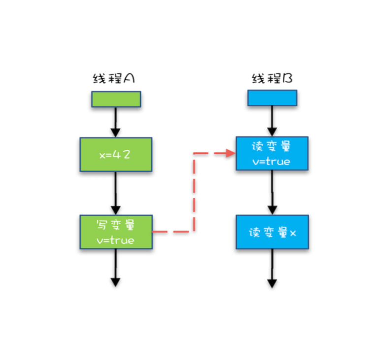

# Java内存模型：解决可见性、有序性问题
导致可见性的原因是缓存，导致有序性的原因是编译优化，那解决可见性、 有序性最直接的办法就是**按需禁用缓存和编译优化**，

Java 内存模型规范了 JVM 如何提供按需禁用缓存和编译优化的方法。具体来说，这些方法包括
- volatile
- synchronized
- final
- 六项 Happens-Before 规则

## 1. volatile
volatile 关键字并不是 Java 语言的特产，古老的 C 语言里也有，它最原始的意义就是禁用 CPU 缓存。

声明一个 volatile 变量 volatile int x = 0，它表达的是:告诉编译器， 对这个变量的读写，不能使用 CPU 缓存，必须从内存中读取或者写入。

## 2. Happens-Before
前面一个操作的结果对后续操作是可见的。
Happens-Before 约束了编译器的优化行为，虽允许编译器优化，但是要求编译器优化后一定遵守 Happens- Before 规则。

### 2.1 顺序性规则
在一个线程中，按照程序顺序，前面的操作 Happens-Before 于后续的任意322 操作。

程序前面对某个变量的修改一定是对后续操作可见的。

```
class VolatileExample {
  int x=0;
  volatile boolean v = false;

  public void writer() {
    x = 42;
    v = true;
  }

  public void reader() {
    if (v == true) {
      // 这里 x 会是多少呢?
    }
  }
}
```
按照程序的顺序，第 6 行代码 “x = 42;” Happens-Before 于第 7 行代码 “v = true;”，这就是规则 1 的内容，也比 较符合单线程里面的思维:程序前面对某个变量的修改一定是对后续操作可见的。

### 2.2 volatile
一个 volatile 变量的写操作， Happens-Before 于后续对这个volatile
变量的读操作。

### 2.3 传递性
如果 A Happens-Before B，且 B Happens-Before C，那么 A Happens-Before C。


1. “x=42” Happens-Before 写变量 “v=true” ，这是规则 1 的内容;
2. 写变量“v=true” Happens-Before 读变量 “v=true”，这是规则 2 的内容 。

**结论：**x=42” Happens-Before 读变 量“v=true”。

如果线程 B 读到了“v=true”，那么线程 A 设置的“x=42”对线程 B 是可见的。也就是 说，线程 B 能看到 “x == 42” ，有没有一种恍然大悟的感觉?这就是 1.5 版本对 volatile 语义的增强，这个增强意义重大，1.5 版本的并发工具包(java.util.concurrent) 就是靠 volatile 语义来搞定可见性的，

### 2.4 管程中的锁规则
一个锁的解锁 Happens-Before 于后续对这个锁的加锁。
管程是一种通用的同步原语，在 Java 中指的就是 synchronized，synchronized 是 Java 里对管程的实现。

管程中的锁在 Java 里是隐式实现的，例如下面的代码，在进入同步块之前，会自动加锁， 而在代码块执行完会自动释放锁，加锁以及释放锁都是编译器帮我们实现的。

```
synchronized (this){
  // x是共享变量，初始值 = 10
  if (this.x < 12){
    this.x = 12;
  }
}// 此处解锁
```
假设 x 的初始值是 10，线程 A 执行完代码块后 x 的值会变成 12(执行完自动释放锁)，线程 B 进入代码块时，能够看到 线程 A 对 x 的写操作，也就是线程 B 能够看到 x==12。

### 2.5 线程start()规则
主线程 A 启动子线程 B 后，子线程 B 能够看到主线程在启动子线程 B 前的操作。

如果线程 A 调用线程 B 的 start() 方法(即在线程 A 中启动线程 B)，那么该 start() 操作 Happens-Before 于线程 B 中的任意操作。具体可参考下面示例代码。

```
Thread B = new Thread(()->{
  // 主线程调用 B.start()之前
  // 所有对共享变量的修改，此处皆可见
  // 此例中，var==77
})；
// 此处对共享变量 var 修改
var = 77;
// 主线程启动子线程
B.start();

```

### 2.6 线程join()规则
**join()**：主线程 A 等待子线程 B 完成(主线程 A 通过调用子线程 B 的 join() 方法实现)，当子线程 B 完成后(主线程 A 中 join() 方法返回)，主线程能够看到子线程的操作。当然所谓的“看到”，指的是对共享变量的操作。

如果在线程 A 中，调用线程 B 的 join() 并成功返回，那么线程 B 中的任
意操作 Happens-Before 于该 join() 操作的返回。具体可参考下面示例代码。

```
Thread B = new Thread(()->
  // 此处对共享变量var修改
  var = 66;
});

// 例如此处对共享变量修改，则这个修改结果对线程B可见
// 主线程启动子线程
B.start()；
B.join();

// 子线程对所有共享变量的修改
// 在主线程中调用 B.join()之后皆可见
// 此例中，var == 66
```

### 2.7 final
final 修饰变量时，初衷是告诉编译器:这个变量生而不变，可以可劲儿优化。

#### (1) 逸出
在下面例子中，在构造函数里面将 this 赋值给 了全局变量 global.obj，这就是“逸出”，线程通过 global.obj 读取 x 是有可能读到 0 的。因此我们一定要避免“逸出”。因此我们一定要避免“逸出”。

```
// 以下代码来源于【参考 1】
final int x;
// 错误的构造函数
public FinalFieldExample() {
  x=3;
  y=4;
  // 此处就是讲 this 逸出，
  global.obj = this;
}
```

## 3. 总结
在 Java 语言里面，Happens-Before 的语义本质上是一种可见性，A Happens-Before B 意味着 A 事件对 B 事件来说是可见的，无论 A 事件和 B 事件是否发生在同一个线程里。 例如 A 事件发生在线程 1 上，B 事件发生在线程 2 上，Happens-Before 规则保证线程 2 上也能看到 A 事件的发生。
