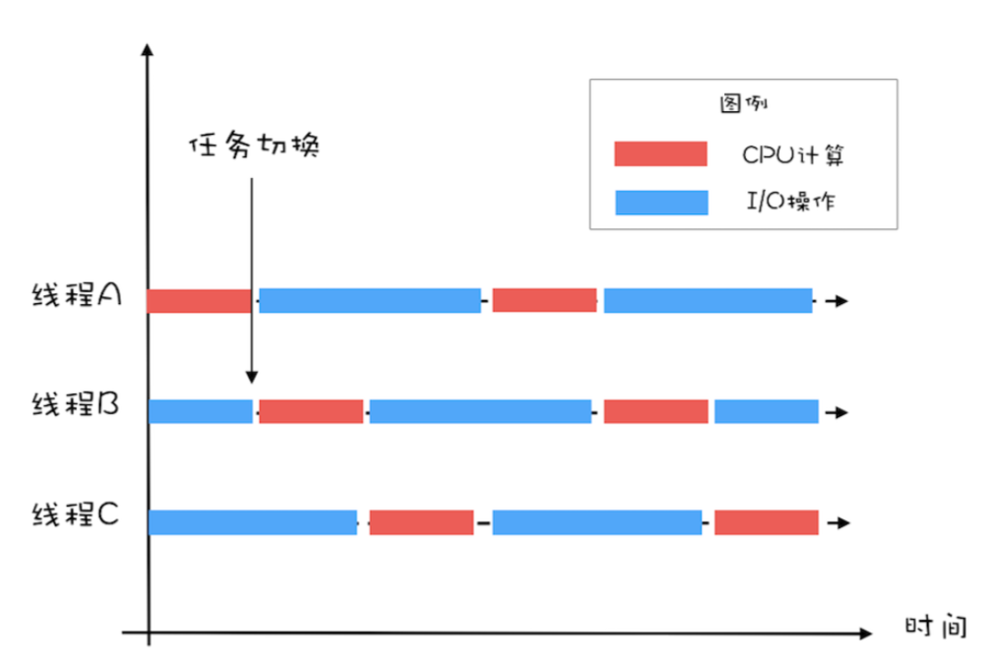

 ## 1. 为什么使用多线程？
 降低延迟，提高吞吐量。
 - **延迟**：发出请求到收到响应这个过程的时间;延迟越短，程序执行得越快，性能也越好。
 - **吞吐量**：在单位时间内能处理请求的数量;吞吐量越大，程序能处理的请求越多，性能越好。

 ## 2. 应用场景
 在并发编程领域， 提升性能本质上就是提升硬件的利用率。操作系统解决硬件利用率问题的对象往往是单一的硬件设备，而 我们的并发程序，往往需要 CPU 和 I/O 设备相互配合工作，也就是说，我们需要解决提升 **I/O的利用率** 和 **CPU的利用率**的问题。


## 3. 创建多少线程合适
### 3.1 CPU密集型场景

对于 CPU 密集型的计算场景，理论上“线程的数量 =CPU 核数”就是最合适的。不过在工 程上，线程的数量一般会设置为“CPU 核数 +1”，这样的话，当线程因为偶尔的内存页失效或 其他原因导致阻塞时，这个额外的线程可以顶上，从而保证 CPU 的利用率。

### 3.2 I/O 密集型场景
对于 I/O 密集型的计算场景，比如前面我们的例子中，如果 CPU 计算和 I/O 操作的耗时是 1:1，那么 2 个线程是最合适的。如果 CPU 计算和 I/O 操作的耗时是 1:2，那多少个线程合适 呢?是3 个线程，如下图所示:CPU 在 A、B、C 三个线程之间切换，对于线程 A，当 CPU 从 B、C 切换回来时，线程 A 正好执行完 I/O 操作。这样 CPU 和 I/O 设备的利用率都达到了 100%。



通过上面这个例子，我们会发现，对于 I/O 密集型计算场景，最佳的线程数是与程序中 CPU 计 算和 I/O 操作的耗时比相关的，我们可以总结出这样一个公式:
```
最佳线程数 =1 +(I/O 耗时 / CPU 耗时)
```

我们令 R=I/O 耗时 / CPU 耗时，综合上图，可以这样理解:当线程 A 执行 IO 操作时，另外 R 个线程正好执行完各自的 CPU 计算。这样 CPU 的利用率就达到了 100%。

多核CPU计算公式：
```
最佳线程数 =CPU 核数 * [ 1 +(I/O 耗时 / CPU 耗时)]
```
