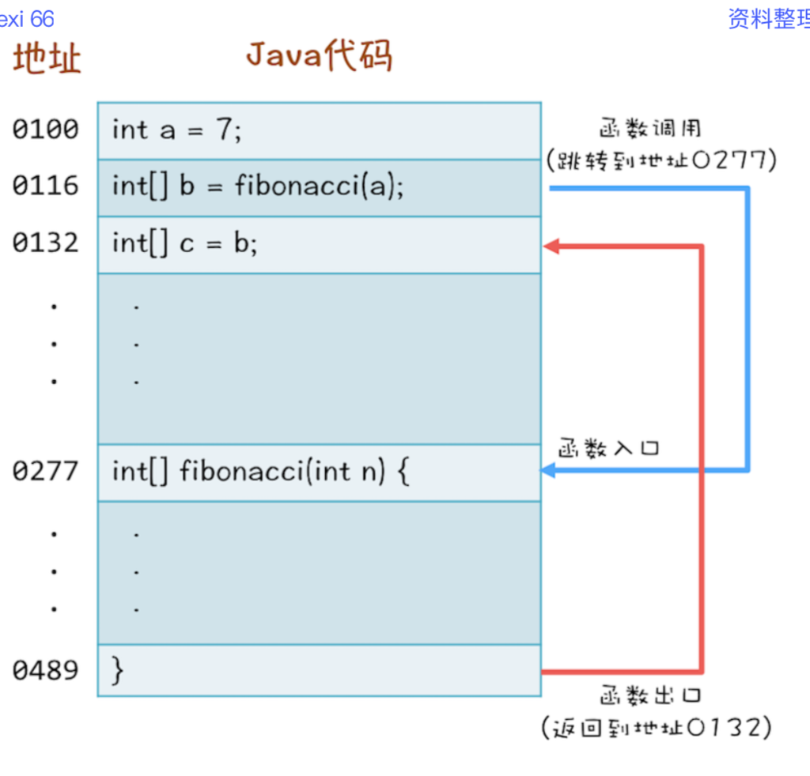
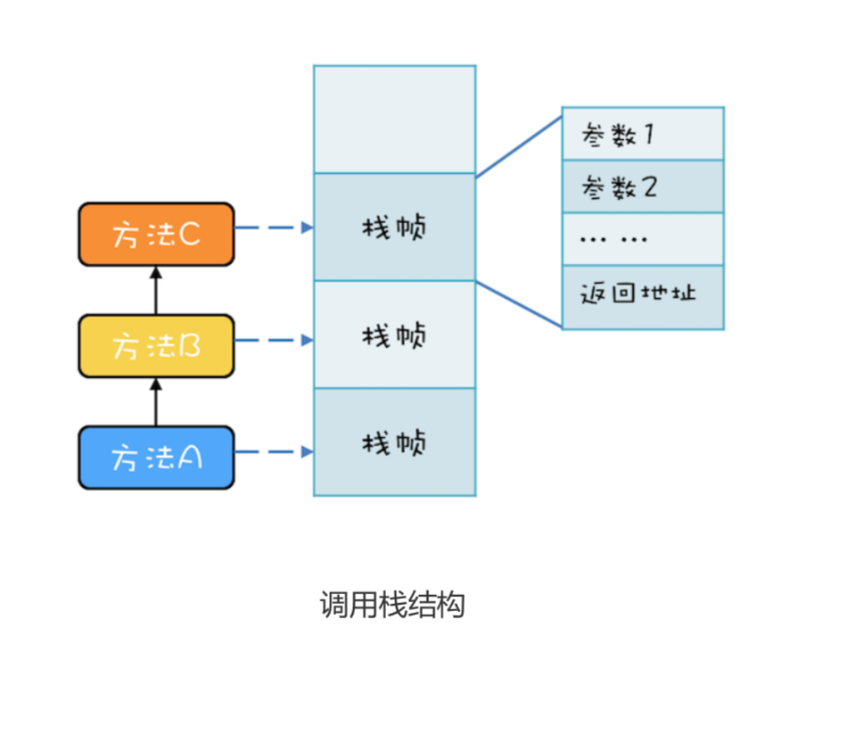
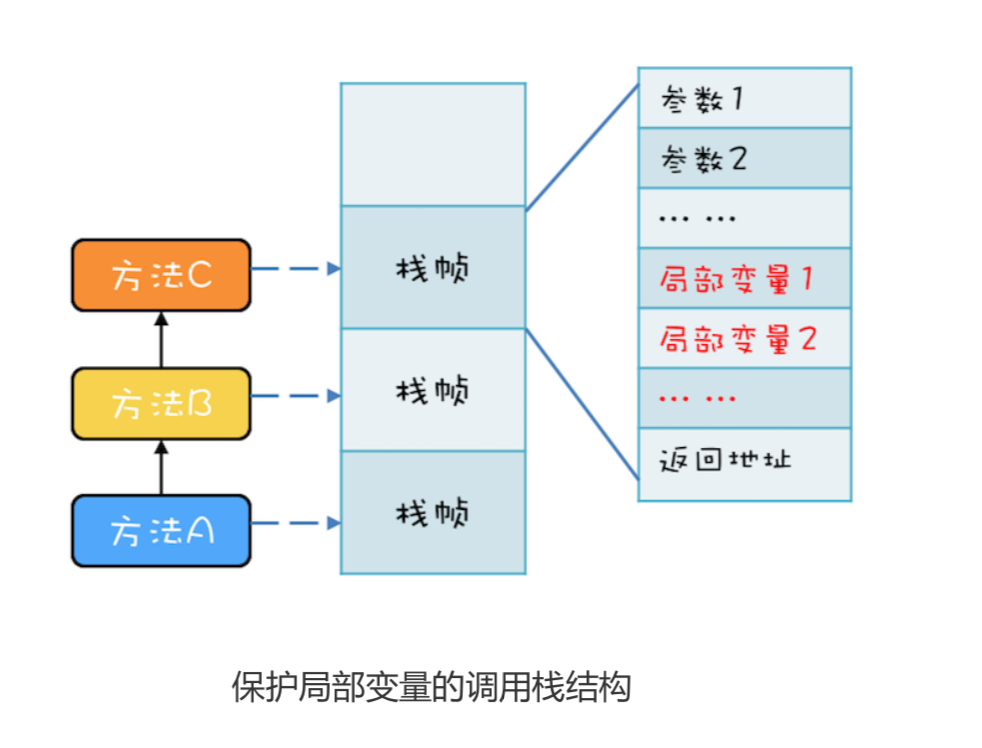
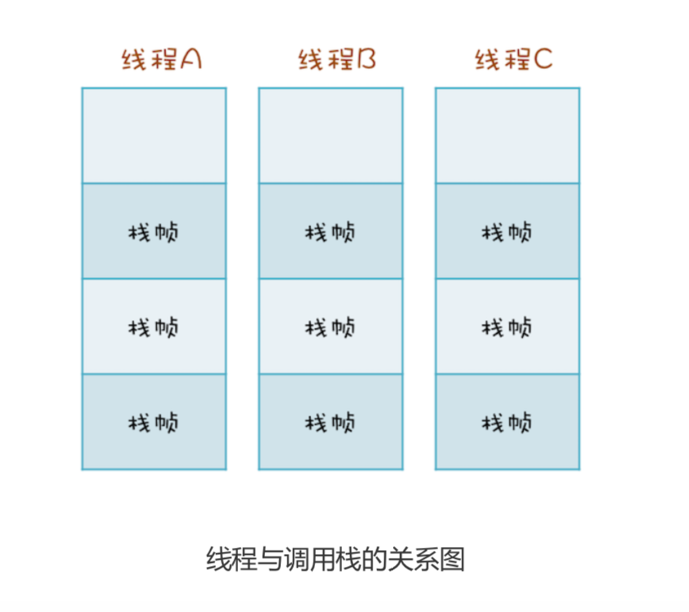

# 局部变量

当多个线程调用 fibonacci() 这个方法的时候，数组 r 是否存在数据竞争(Data Race)呢?
```
// 返回斐波那契数列
int[] fibonacci(int n) {
   // 创建结果数组
   int[] r = new int[n];
   // 初始化第一、第二个数
   r[0] = r[1] = 1; // 1
   // 计算 2..n
   for(int i = 2; i < n; i++) {
     r[i] = r[i-2] + r[i-1];
   }
   return r;
}
```

## 1. 方法如何被执行

```
int a = 7;
int[] b = fibonacci(a);
int[] c = b;
```



CPU通过**堆栈寄存器**找到调用的方法的参数和返回地址。

### 1.1 栈帧
每个方法在调用栈里都有自己的独立空间，每个栈帧里都有对应方法需要的**参数**和**返回地址**。当调用方法时，会创建新的栈帧，并压入调用栈;当方法返回时，对应的栈帧就会被自动弹出。**栈帧和方法是同生共死的。**

有三个方法 A、B、C，他们的调用关系是 A->B->C(A 调用 B，B 调用 C)：


 利用栈结构来支持方法调用这个方案非常普遍，以至于 CPU 里内置了栈寄存器。虽然各家编程 语言定义的方法千奇百怪，但是方法的内部执行原理却是出奇的一致:都是靠栈结构解决的。 Java 语言虽然是靠虚拟机解释执行的，但是方法的调用也是利用栈结构解决的。

## 2. 局部变量存储
局部变量就是放到了调用栈里。


## 3. 调用栈与线程
两个线程可以同时用不同的参数调用相同的方法，那调用栈和线程之间是什么关系呢?答案是: **每个线程都有自己独立的调用栈**。因为如果不是这样，那两个线程就互相干扰了。如下面这幅图 所示，线程 A、B、C 每个线程都有自己独立的调用栈。


## 4. 线程封闭
线程封闭：仅在单线程内访问数据。方法里的局部变量，因为不会和其他线程共享。

案例：
从数据库连接池里获取的连接 Connection，在 JDBC 规 范里并没有要求这个 Connection 必须是线程安全的。数据库连接池通过线程封闭技术，保证一 个 Connection 一旦被一个线程获取之后，在这个线程关闭 Connection 之前的这段时间里，不 会再分配给其他线程，从而保证了 Connection 不会有并发问题。
